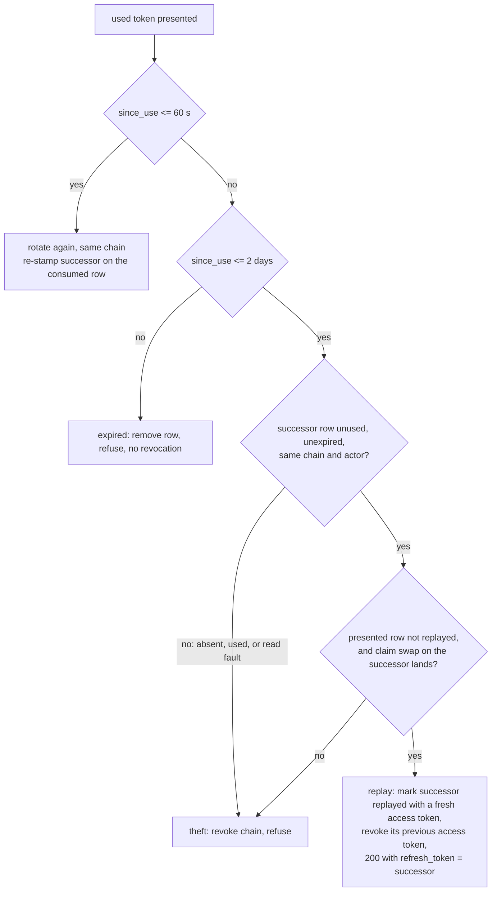

# Implementation Plan: a dropped refresh rotation is not theft (replay the recorded successor, both ladders)

**Date:** 2026-09-26
**Research:** thoughts/research/2026-09-26-spa-refresh-reuse-after-dropped-rotation.md
**Branch:** was `release/3.15.0-dropped-rotation` (renamed
`release/3.15.0-refresh-grace` for the successor plan); nothing from this
plan was committed.

> **Superseded 2026-09-27 by the owner's decision.** Implementing Phase 2
> showed the replay as designed disables theft detection (see the
> `[Updated 2026-09-27]` note under Decisions Made). The `replayed` patch
> that closed it was a second self-invented mechanism on top of the first.
> The owner chose to stay on standard mechanisms instead: a configurable
> grace period (a reuse interval, as identity vendors offer, capped at 60 s)
> and client-side fixes for the lost response. The
> Phase 1 and 2 code was reverted on the branch before any commit, except
> the SPA store's expiry-before-used order, which the successor plan
> carries forward. Kept as the record of what was tried and why it was
> dropped.

## Overview

A native client that issues a refresh and never receives the response (a
sleeping laptop) keeps its old refresh token, presents it minutes later, and
is treated as a thief: the whole chain is revoked and the user re-logs in.
Verified in production four times in 22 days for one user. The server is the
only party that can tell a dropped rotation from theft, by a structural
signature: **the reused token's direct successor has never been presented.**
This plan records the successor on every rotation and, when a reused token's
successor is still unused, **replays that successor** (the same refresh
token string, with a fresh access token) instead of revoking the chain. No
new token is forked, so the existing ladder on the successor's own first use
is the theft detector: whoever presents the successor second, past the
grace period, trips it. Both token stores (SPA and MCP) get the rule through
the shared single-use layer.

## Decisions Made

- **Replay the recorded successor; do not fork.** Owner, 2026-09-26, on the
  outside voice's finding. A reuse past the grace period whose successor is
  unused answers 200 with `refresh_token = successor` and a fresh access
  token. Compared with the draft's orphan-and-reissue design this needs one
  read-only helper instead of two compare-and-swap primitives, has no orphan
  state, no re-stamp, no crash window between writes, no two-live-successor
  race, and is safe under a mixed-version rollout (an old worker answers the
  replay with today's theft branch, which is no worse than today).
  **[Updated 2026-09-27, pending owner confirmation]** Implementing Phase 2
  showed the replay as specified disables theft detection. A thief who
  uses the victim's current refresh token first gets its successor S2; the
  victim's reuse is replayed S2; from then on each holder's reuse finds an
  unused successor and is replayed again, indefinitely, with no chain
  revocation. Today's ladder catches the victim's first reuse past 60 s.
  Plan case 2 as written ("the second, past 60 s, → 401") failed against
  the Phase 2 code. **Fix applied (Phase 2):** the replay is claimed by a
  compare-and-swap on the successor's row that also marks it `replayed`;
  a consumed row carrying `replayed` is never replayed again, and a lost
  claim is answered as theft. Detection now fires at the second
  divergence, whoever presents first. **The trade:** a client whose next
  rotation after a replay is dropped too is locked out, as every dropped
  rotation is today (two consecutive drops, not one). The alternative is
  the orphan design the evaluators rejected.
- **Both ladders, one implementation.** Owner, 2026-09-26. The helper lives
  in `actingweb/single_use.py`; `oauth2_spa.py` and `token_manager.py` call
  it through their stores.
- **The successor's recorded access token is revoked on replay, by name.**
  Owner, 2026-09-26 (chosen as "revoke the chain's access tokens";
  narrowed to a point delete on the scalability finding). After a rotation
  the chain's live access token is the successor's, whose name the MCP
  refresh record already carries (`access_token`) and the SPA record will
  carry from this plan. Deleting it forces a legitimate holder of the
  successor to refresh on its next API call, which is where theft after
  legitimate use is detected. It goes through the index-first
  `_remove_access_token(actor_id=...)` on MCP and `revoke_access_token` on
  SPA: no chain scan, no `delete_by_chain` on a routine path. Grace-tier
  siblings under an hour are not chased (the accepted grace trade).
- **Bound: the consumed row's own TTL, two days from first use, on both
  stores.** Owner, 2026-09-26. The replay never re-stamps `used_at` or the
  TTL, so a client that never persists its rotated token keeps working for
  two days after its first refresh and then re-logs in (today: one hour).
  The MCP index row's shortened TTL already matches; nothing to add. No
  counter, no new constant.
- **Horizon: successor state alone, within the existing 2-day reuse
  window.** Owner, 2026-09-26.
- **The successor is stamped atomically with the consume.** The new refresh
  token string is generated before the compare-and-swap and passed in
  `consume_once(stamp=)`, which already exists for the MCP chain id. The
  record is then created with that string (`create_refresh_token(token=)`,
  `_create_refresh_token(token=)`, additive keyword-only). If the mint fails
  after the consume, the row points at an absent successor, which the
  ladder treats as "used" (theft past the grace period): today's mint-fault
  contract, unchanged.
- **The grace tier keeps the successor current.** A rotation inside the
  grace period mints a new pair without touching the consumed row today.
  From this plan it also re-stamps `successor` to the token it just issued
  (compare-and-swap, `used_at` untouched, TTL untouched), so the recorded
  successor is always the most recent one the server handed out. Without
  it, a grace duplicate after a replay leaves the row pointing at an older
  successor and a thief could be replayed a token nobody holds.
- **What counts as "unused successor".** The successor row read strictly
  (`get_attr_strict`; a read fault refuses the replay), present, `used`
  falsy, its own `expires_at` in the future, `chain_id` equal to the
  presented token's, and (SPA, shared bucket) `actor_id` equal. Anything
  else is theft, as today. An absent row is one case: the backends hide
  TTL-expired rows behind `get_attr_strict`, so "purged" and "expired" are
  the same outcome.
- **The replay only runs for chained rows.** A legacy row (no `chain_id`)
  has no successor and keeps today's behaviour: the presented token alone is
  revoked.
- **The order of the tiers stays: grace before the successor check.** A
  concurrent duplicate inside 10 s would otherwise be answered with the
  successor the same client is about to store from the first response,
  which is fine, but a fast retry after a *replay* must not re-consume.
  Keeping the grace tiers first preserves today's concurrent-duplicate
  behaviour exactly.
- **The SPA store checks `expires_at` before `used`.** Today it returns a
  used row before the expiry check (`oauth_session.py:717-724`), the MCP
  store the reverse. With replay, a used SPA row past its 14-day `expires_at`
  must not be replayable; the order is made the MCP one.
- **The replay's fresh access token is written back to the successor's
  record**, best-effort by compare-and-swap on the successor's unused
  record, so the chain still has one live access token that the successor's
  eventual rotation revokes. A lost swap (the successor was consumed
  meanwhile) is logged at DEBUG; the fresh token then lives out its hour.
  **[Updated 2026-09-27]** The swap is now load-bearing, not best-effort:
  it also sets `replayed`, and it runs before the old access token is
  revoked. A lost swap removes the freshly minted access token and answers
  as for theft. That also closes the "replay races the successor's own
  consume" failure scenario.
- **Logging.** The replay logs at **WARNING** with a distinct phrase
  ("dropped rotation replayed"), `since_use`, the chain prefix and the
  actor, because production runs at WARNING and the line is the only lead
  when a theft in the same chain is detected later. Tokens are never logged
  (`_mask`).
- **No `predecessor` field.** Nothing reads it.
- **Release: 3.15.0, own PR, before rc1.** The reuse answer changes from
  401-and-revoke to 200-and-replay: a **Behavior change** entry and a
  migration-guide section, in the release that introduces the MCP ladder.

## What We're NOT Doing

- **Changing the 60 s grace or the 2-day reuse window** — the successor
  check carries the decision; the tiers stay as documented.
- **A shorter ceiling on replays** — the consumed row's TTL is the bound;
  the owner declined a new constant.
- **The consumer's client changes** (dark-wake refresh policy, Keychain
  write handling, the dormant-Mac capture) — the library fix needs nothing
  from the client but a pin bump; the rest is the consumer's #109.
- **Chasing grace-era access tokens on replay** — a rotation inside the
  grace period leaves the previous pair's access token alive for its hour
  today; unchanged, and it belongs to the same client.
- **Closing the rotation-versus-chain-revocation race** — a replay whose
  chain is revoked between the successor read and the response still
  answers 200 with tokens that carry the chain id; the next revocation
  removes them. The same residual the 3.15 plan accepted for rotation.
- **Cross-process cache invalidation** — the per-process 300 s window is
  unchanged.
- **A browser-side test of two tabs** — no test account exists here; the
  behaviour is stated in the docs (a fork's second holder trips the wire,
  as today).
- **A version gate for the rollout** — an old worker answers a replay with
  today's theft branch; the migration guide states the convergence window.
- **The SPA store's fault contract** (a `StoreFault` on refresh answers 401
  and forces a re-login; `revoke_token_chain` has no fault handling, so on
  PostgreSQL a faulted chain delete still answers "session revoked" while
  the chain survives) — pre-existing, raised by the PR #148 review, filed as
  `thoughts/todo/token-store-fault-contract-gaps.md`. Phase 2 rewrites
  exactly those functions and moves the SPA tests onto the fault-injecting
  double, so the owner was to decide at approval whether Phase 2 absorbs the
  two SPA items (a 503 + `Retry-After` on the SPA refresh grant is a
  consumer-visible change) or they stay filed. `/implement_plan` was
  invoked on 2026-09-27 without that decision, so they **stay filed**
  (deduced, not confirmed).

## What Already Exists

- `actingweb/single_use.py` — `consume_once(..., stamp=)`, `StoreFault`,
  `delete_confirmed`, `_mask`. The successor rides in `stamp`; the new
  helper sits beside them.
- `actingweb/attribute.py` `Attributes.conditional_update_attr(name,
  old_data, new_data, ttl_seconds=)` — reused for the grace-tier successor
  re-stamp and the access-token write-back.
- `actingweb/db/*/attribute.py` `get_attr_strict` — absence versus fault;
  hides TTL-expired rows on both backends (`dynamodb/attribute.py:132-133`,
  `postgresql/attribute.py:310-311`).
- `actingweb/oauth_session.py:554-600` `create_refresh_token` (generates
  the string; gains `token=` and `access_token=`), `:514`
  `revoke_access_token(token)`, `:680` `try_mark_refresh_token_used`
  (gains `successor=`), `:709-724` the read whose order changes.
- `actingweb/handlers/oauth2_spa.py:610-745` — the SPA ladder and mint;
  `:1587` `_generate_actingweb_token(actor_id, identifier, chain_id=)`.
- `actingweb/oauth2_server/token_manager.py:371-372` (chain id, then
  `_consume(stamp=)`), `:409-460` (the ladder), `:469-490` (mint and
  response), `:822` `_create_access_token_from_refresh`, `:846`
  `_create_refresh_token`, `:1217` `_remove_access_token(actor_id=...)`
  (index-first, confirmed).
- `tests/mcp_token_double.py` — `cas_hook`, `cas_fault`, `faulty_buckets`,
  `delete_faults`, `ttls`, `get_attr_strict`. Both stores' handler tests
  use it (Phase 2 moves the SPA tests onto it).
- `tests/integration/test_mcp_refresh_rotation_backend.py` — rotation on
  real DynamoDB and PostgreSQL; `_age_consumed` copies the row's data so a
  stamp survives aging.

## The ladder after this plan

The theft detector after a replay is the `replayed` mark: two holders of
the same replayed successor diverge, and the second presenter past the
grace period lands in `T`. (Updated 2026-09-27: without the mark the second
presenter would be replayed again, indefinitely.)

## Phase 1: The shared helper in `single_use.py`

### Changes

- `actingweb/single_use.py`:
  - `unused_successor(config, actor_id, bucket, name, *, chain_id,
    actor_id_field=None) -> dict[str, Any] | None`. Returns the successor
    record when it may be replayed: `name` truthy; `get_attr_strict`
    answers a row (a fault, caught, returns `None` and logs at WARNING
    with `_mask(name)`); `data` is a dict; `used` falsy; `expires_at` in
    the future; `data["chain_id"] == chain_id`; and, when
    `actor_id_field` is given, `data[actor_id_field] == actor_id`. Read
    only; never writes.
  - `consume_once` docstring: the stamp is where a successor is recorded.
  - Module docstring: the successor rule in three sentences.
- `tests/mcp_token_double.py`: no new fault modes; `faulty_buckets` gives
  the read fault, `ttls` is not consulted (expiry is the record's own
  `expires_at`).

### New Tests, both unit and integration tests

- `tests/test_single_use.py` (on `mcp_token_double.make_config()`):
  - unused, unexpired, same chain → the record;
  - `name=None` → `None` without a read (explicit early return);
  - absent row → `None`;
  - `used` row → `None`;
  - `expires_at` in the past → `None`;
  - chain mismatch → `None`; actor mismatch with `actor_id_field` → `None`;
  - read fault (`faulty_buckets`) → `None`, WARNING logged, the raw name
    absent from `caplog.text`.

### Failure Scenarios

- Successor read faults mid-ladder — replay refused, theft path runs and
  reports the fault as it does today — covered by the read-fault test.
- Successor row present but written by an older worker without
  `chain_id` — mismatch → refused — covered by the chain-mismatch test.

### Verification

- [x] Run the contract's `### Checks` fast tier verbatim (outside the
      sandbox; see Learnings below)

### Implementation Status: Complete, then reverted 2026-09-27 (superseded)

**Deviations (2026-09-27):**
- `actor_id_field=` became `owner: tuple[str, str] | None`. SPA tokens
  all live in the system actor's partition, so the actor the helper reads
  from is not the owner the record must name; the pair carries the field
  and the expected value.
- `chain_id=None` returns `None` without a read, like `name=None`.
- `REPLAYED` (the field name) was added here in Phase 2, with the rule in
  the module docstring.
- Tests: ten in `tests/test_single_use.py`, including "never writes".

---

## Phase 2: The SPA ladder

### Changes

- `actingweb/oauth_session.py`:
  - `create_refresh_token(..., token: str | None = None, access_token:
    str | None = None)` — use the given string instead of generating one;
    record `access_token` on the row. Additive, keyword-only. New
    `new_refresh_token_string() -> str` holds the format
    (`secrets.token_urlsafe(48)`) so the handler and the mint agree.
  - `try_mark_refresh_token_used(token, *, successor: str | None = None)`
    — check `expires_at` before `used` (`:717-724` reordered); pass
    `stamp={"successor": successor}` to `consume_once` when given.
  - `replayable_successor(token_data) -> dict | None` — wraps
    `single_use.unused_successor` with the SPA bucket, the system actor,
    `chain_id=token_data.get("chain_id")` and `actor_id_field="actor_id"`;
    returns `None` when `token_data` has no `chain_id`.
  - `restamp_successor(token_data, successor) -> bool` — compare-and-swap
    `token_data` → `token_data + {"successor": successor}`, `used_at` and
    TTL untouched (pass `ttl_seconds=SPA_REFRESH_TOKEN_REUSE_WINDOW` so the
    swap keeps the shortened TTL; both backends set it from now, which is
    at most seconds later). Never an upsert.
  - `set_refresh_token_access_token(successor_record, successor, access_token)
    -> bool` — compare-and-swap the unused successor's record to carry the
    replay's fresh access token; a lost swap returns `False`.
- `actingweb/handlers/oauth2_spa.py`, the refresh handler (`:610-745`):
  - `new_refresh = session_manager.new_refresh_token_string()` before the
    consume; `try_mark_refresh_token_used(refresh_token,
    successor=new_refresh)`.
  - Grace tiers (`:662-673`): after deciding to rotate, the mint stays as
    is, then `session_manager.restamp_successor(token_data, new_refresh)`
    (a lost swap is DEBUG; the response is unaffected).
  - Theft tier (`:682-716`): if `token_data.get("chain_id")` and
    `successor := session_manager.replayable_successor(token_data)`:
    - `session_manager.revoke_access_token(successor.get("access_token"))`
      when present (best-effort; a `False` is logged at WARNING and the
      replay proceeds: the access token expires within the hour and the
      refresh rule is the security property);
    - `fresh = self._generate_actingweb_token(actor_id, identifier or "",
      chain_id=chain_id)`;
    - `session_manager.set_refresh_token_access_token(successor,
      token_data["successor"], fresh)` (best-effort);
    - WARNING `"Refresh token reuse {since_use}s after first use for actor
      {actor_id} - dropped rotation replayed (chain {chain_id[:8]}...)"`;
    - answer exactly as the normal rotation does but with
      `refresh_token=token_data["successor"]` and `access_token=fresh`
      (JSON body or cookies per `token_delivery`; the same
      `refresh_token_expires_in`). Return; do not fall through to the mint.
    Else the existing revocation and 401 (body unchanged: "Refresh token
    already used - session revoked for security").
  - The mint (`:726`): `create_refresh_token(actor_id, identifier,
    chain_id=chain_id, token=new_refresh, access_token=new_access_token)`.
    The other three `create_refresh_token` callers (`:942`, `:1098`,
    `:1342`, the login paths) gain `access_token=` too, so every refresh
    record names its access token.
  - Legacy chain-less rows (`:707-714`) unchanged.
- `tests/test_oauth2_spa_refresh_rotation.py`: the handler tests move
  onto `tests.mcp_token_double.make_config()` (the handler needs
  `config.new_token()` and `config.DbAttribute`, both real there); the
  local `_make_config` double stays only for tests that need nothing
  else. `_seed_used_token` gains `successor: Literal["absent", "used",
  "unused"] = "absent"` and returns the successor string; the existing
  `test_reuse_beyond_grace_window_revokes_only_the_chain` passes
  `"used"` explicitly so it keeps pinning theft.

### New Tests, both unit and integration tests

In `tests/test_oauth2_spa_refresh_rotation.py`, one per case:

1. **The production case.** Reuse 981 s after first use (the report's
   number), successor unused → 200, `refresh_token` equals the recorded
   successor, `access_token` is new, same `chain_id`; the successor's
   previous access token no longer validates; nothing in the chain is
   revoked; the consumed row's `used_at` and `successor` are unchanged.
   Fails today (401, chain revoked).
2. **Divergence is theft.** After a replay, the successor is presented
   twice: the first consumes it and rotates; the second, past 60 s, → 401
   and the chain is revoked (today's ladder, now the detector).
3. **Successor used** → 401, chain revoked (today's behaviour, now
   conditional).
4. **Successor absent or expired** (one case; seeded by `expires_at` in
   the past, and separately by deleting the row) → 401, chain revoked.
5. **Chain mismatch**: a successor stamped from another chain → 401.
6. **Rotation stamps `successor`** on the consumed row and the successor's
   record exists under that name with the same `chain_id` and its
   `access_token`.
7. **Repeated drop**: two replays of the same token, 10 minutes apart →
   both 200 with the same successor; the second's fresh access token
   differs; `used_at` never moves.
8. **Bound**: a consumed row aged past the reuse window → 401 "expired",
   no revocation (today's tier; pins the 2-day ceiling).
9. **Grace re-stamp**: a grace-tier duplicate after a rotation re-stamps
   `successor` to the token it issued, and `used_at` is unchanged; a replay
   afterwards returns that token.
10. **Legacy** chain-less token past the grace period → only itself
    revoked (unchanged).
11. **Expiry before used**: a used row past `expires_at` → 401 "expired",
    row removed, no replay, no revocation.
12. **Faults**: successor read fault (`faulty_buckets` on the refresh
    bucket for the successor read only, via `cas_hook`-style scoping or a
    name-scoped fault) → 401 theft path; access-token revoke fault
    (`delete_faults`) → replay still 200, WARNING logged.
13. **Logs**: the replay line is WARNING, carries `since_use` and the
    chain prefix, and no token appears in `caplog.text`.

Integration: none for SPA (no SPA rotation backend test exists; the MCP
backend test in Phase 3 exercises the shared helper and the stamp on both
backends).

### Failure Scenarios

- Mint fails after the consume — the row names an absent successor;
  retry within 60 s rotates, after → theft — the existing mint-fault test,
  extended to assert the successor is absent.
- Successor expired under the client (TTL lag) — absent → theft — case 4.
- Access-token revoke faults — replay proceeds, WARNING — case 12.
- Write-back of the fresh access token loses its swap — DEBUG; the token
  lives out its hour — a test asserting the response is still 200.
- Replay races the successor's own consume — `unused_successor` read it
  unused, the client rotates it a moment later. **[Updated 2026-09-27]**
  The claim swap loses, the fresh access token is removed and the reuse is
  theft — `test_a_successor_used_during_the_replay_is_theft`.

### Verification

- [x] Run the contract's `### Checks` fast tier verbatim
- [x] `poetry run pytest tests/test_oauth2_spa_refresh_rotation.py
      tests/test_oauth_session.py -q` (47 passed)
- [x] Full tier on Phases 1–2 together (2026-09-27, outside the sandbox):
      ruff, format and pyright clean; DynamoDB 3712 passed, 31 skipped;
      PostgreSQL 3601 passed, 140 skipped, 2 failed, both the benchmark
      subscription tests already filed
      (`benchmark-subscription-tests-pass-url-to-boolean-callback.md`);
      `sphinx-build -W` clean.

### Implementation Status: Complete, then reverted 2026-09-27 (superseded)

**Deviations (2026-09-27):**
- **The `replayed` rule** (see the updated decision): case 2 as the plan
  stated it failed against the plan's design; fixed as recorded there.
  Pending the owner's confirmation of the two-consecutive-drops trade.
- `set_refresh_token_access_token` became `claim_replay(record, token,
  access_token)`: it sets `replayed` too and is load-bearing. The handler
  mints the fresh access token, claims, and only then revokes the
  successor's previous access token; a lost claim revokes the fresh token
  and falls to the theft branch. `_replay_successor` returns `None` then.
- `restamp_successor(token, token_data, successor)` takes the consumed
  token's name; the record alone does not carry it.
- `replayable_successor` refuses a row with `replayed` set and passes
  `owner=("actor_id", token_data["actor_id"])`.
- Two more `create_refresh_token` callers the plan missed,
  `handlers/oauth2_callback.py` (the SPA-mode callback and the SPA
  redirect login), gain `access_token=` like the three in
  `oauth2_spa.py`.
- The grace re-stamp runs at the mint (`not success` reaches the mint
  only from the grace tiers).
- The whole SPA rotation test file moved onto `tests/mcp_token_double.py`
  (the local double is gone; nothing needed it).

**Tests added beyond the thirteen cases:** a thief using the victim's
current token first is detected at the second divergence; two
consecutive dropped rotations lock the client out (pins the trade); a
successor used between the read and the claim is theft and leaves no
fresh access token; a failed mint leaves an absent successor that reads
as theft past the grace period (no SPA mint-fault test existed to
extend). 16 of the 20 fail on `master`.

---

## Phase 3: The MCP ladder

**Not started; the plan was superseded 2026-09-27 before this phase.**
If confirmed, this phase mirrors Phase 2's deviations: the replay mints,
then claims the successor by compare-and-swap (`access_token`,
`access_token_id`, `replayed=True`), then point-deletes the previous access
token; a lost claim deletes the fresh token and falls to `_revoke_chain`;
`unused_successor` is not consulted for a consumed row with `replayed`
set; and the attacker, double-drop, claim-race and mint-fault tests are
ported with the thirteen cases. The backend integration test's second
presentation then answers `None` as written.

### Changes

- `actingweb/oauth2_server/token_manager.py`:
  - `_new_refresh_token_string() -> str` (`f"rt_{secrets.token_urlsafe(32)}"`);
    `_create_refresh_token(..., token: str | None = None)`.
  - `refresh_access_token`: `new_rt = self._new_refresh_token_string()`
    before `_consume`; the stamp becomes `{"successor": new_rt}` plus
    `chain_id` for legacy rows. Grace tier (`:434-442`): after the mint,
    compare-and-swap `successor` on the consumed row (`used_at` and TTL
    untouched). Theft tier (`:443-455`): if `chain_id` and
    `unused_successor(self.config, actor_id, self.refresh_tokens_bucket,
    current.get("successor"), chain_id=chain_id)`:
    - `self._remove_access_token(successor["access_token"],
      actor_id=actor_id, google_token_key=successor.get("google_token_key"))`
      when present, and `evict_caches_for_token` (best-effort, WARNING on
      `False`);
    - `fresh = self._create_access_token_from_refresh(actor_id, client_id,
      chain_id=chain_id)`;
    - compare-and-swap the successor's record: `access_token=fresh["token"]`,
      `access_token_id=fresh["token_id"]` (best-effort);
    - WARNING as in Phase 2;
    - return the response dict with `refresh_token=current["successor"]`,
      `access_token=fresh["token"]`, `expires_in`, `scope`.
    Else the existing `_revoke_chain(anchor=)` and `None` (`invalid_grant`,
    unchanged).
  - The mint (`:472`): `_create_refresh_token(..., token=new_rt)`.
- `tests/test_mcp_refresh_rotation.py`: `_set_used(store, token,
  seconds_ago, *, successor: Literal["absent", "used", "unused"] = "absent")`
  — the seven existing theft tests (`test_reuse_inside_window_revokes_the_whole_chain_only`,
  `test_theft_revocation_with_unreadable_bucket`,
  `test_legacy_record_replayed_after_grace_revokes_its_new_chain`,
  `test_theft_revocation_when_bucket_read_raises`,
  `test_theft_revocation_that_deletes_nothing_is_a_fault[zero|raise]`,
  `test_partial_chain_delete_leaves_the_replayed_token_to_retry_from`)
  pass `successor="used"` explicitly, so their theft pin is visible in the
  test body and does not flip to the replay by accident.
  `TestAnUnconfirmedDeleteStillRevokes` never enters the theft tier and
  needs no change.
- `tests/integration/test_mcp_refresh_rotation_backend.py`.

### New Tests, both unit and integration tests

- `tests/test_mcp_refresh_rotation.py`: the thirteen cases of Phase 2 on
  the MCP double (the response is the full token dict; the theft answer is
  `None`), plus:
  - a legacy row (no chain, no successor) rotates into a fresh chain and
    its consumed row carries both `chain_id` and `successor`;
  - the successor's `access_token`/`access_token_id` are updated by the
    replay, and a later rotation of the successor revokes the replay's
    access token (the one-live-access-token property).
- `tests/integration/test_mcp_refresh_rotation_backend.py::TestRotationOnBackend::test_dropped_rotation_is_replayed_and_divergence_trips`:
  login, rotate (the client "loses" the response), age the consumed row
  past 60 s (`_age_consumed`, which keeps the stamp), present the old
  token → the same successor string comes back with a new access token,
  and the previous access token no longer validates; present the successor
  twice past 60 s → the second answers `None` and the chain is gone. On
  DynamoDB and PostgreSQL.

### Failure Scenarios

- `_remove_access_token` unconfirmed on the replay — index row already
  gone (index-first), WARNING, replay proceeds — `delete_faults` test.
- The successor's write-back swap lost (its owner rotated it meanwhile) —
  DEBUG; the fresh token lives out its hour — a test with `cas_hook`.
- Snapshot/read fault on the successor — theft path, which reports the
  fault as today — `faulty_buckets` test.

### Verification

- [ ] Run the contract's `### Checks` fast tier verbatim
- [ ] `poetry run pytest tests/integration/test_mcp_refresh_rotation_backend.py -q`
      on DynamoDB, and with the PostgreSQL environment

### Implementation Status: Not Started

---

## Phase 4: Docs, changelog, and the superseded decision

### Changes

- `CHANGELOG.rst`, `Unreleased`, SECURITY: extend the rotation entry —
  **Behavior change:** a consumed refresh token presented after the grace
  period whose successor was never used is a dropped rotation: the grant
  answers 200 with that same successor and a fresh access token, and the
  successor's previous access token is revoked; a used, absent or expired
  successor is theft as before. Two holders of one successor are detected
  when the second presents it past the grace period, which revokes the
  chain: theft after legitimate use is detected when the legitimate device
  next refreshes, not instantly, and not at all if it never does. A client
  that never stores its rotated token now works for two days after its
  first refresh, then loses its session (was one hour). During a
  mixed-version rollout an old worker answers a replay as theft, as
  before; behaviour converges once every worker is new. Also amend the
  CHANGED "Breaking: MCP refresh tokens are single-use" entry
  (`CHANGELOG.rst:140-142`, "works once, then reads as theft") and the
  SECURITY sentence at `:72-74`.
- `docs/migration/v3.15.rst`: the rotation section gains the rule; the
  "keeps its first refresh token" paragraph (`:95-96`) becomes "two days";
  the rollout note.
- `docs/reference/security.rst:55-56`, `docs/guides/oauth2-setup.rst:336-341`,
  `docs/guides/troubleshooting.rst:107-122` (title, cause and fix of the
  "asks me to log in again after an hour" section),
  `docs/guides/spa-authentication.rst:686-693`, `:1480-1486`, `:1516-1519`
  (the fork paragraph: the second holder of a successor trips the wire, as
  a client "holding two copies" or a thief): describe the successor rule
  wherever the 60 s grace is described.
- `thoughts/plans/2026-09-25-mcp-oauth-hardening-and-credential-exposure.md`:
  the "Closing the grace-window divergence" entry under *What We're NOT
  Doing* gets `[Superseded 2026-09-26]` pointing here; the Phase 4
  consumer message gains "pin bump; the Mac re-logins (their #109) end".
- No `docs/requirements.txt` change (no dependency change).

### New Tests, both unit and integration tests

- None; `sphinx-build -W` is the check.

### Failure Scenarios

- A guide still says "beyond 60 s is theft" or "one hour" —
  `grep -rn "60 s\|60 seconds\|one hour\|an hour\|grace" docs/` reviewed by
  hand is the verification step.

### Verification

- [ ] Run the contract's `### Checks` full tier verbatim (both backends)
- [ ] the grep above, by hand

### Implementation Status: Not Started

---

## Evaluation Notes

Five evaluators reviewed the first draft (the orphan-and-reissue design),
then the outside voice. The outside voice's simpler shape was adopted; the
notes below record each evaluator's findings and where they landed.

### Architecture
- The draft's MCP access revocation ran `delete_by_chain` and did not
  raise, so a fault left index rows alive: it broke the 3.15 index-first
  invariant on the one path that would not report. **Resolved** by the
  point delete through `_remove_access_token(actor_id=...)`.
- Two compare-and-swap writes with a round trip between them, in an order
  where a crash left the row pointing at an orphan. **Dissolved**: replay
  has one read and best-effort writes only.
- Grace-tier rotations left `successor` stale. **Adopted**: the grace tier
  re-stamps `successor` without touching `used_at`.
- The token-string generators were duplicated in handler and store.
  **Adopted**: `new_refresh_token_string()` / `_new_refresh_token_string()`.
- The SPA double lacks the fault hooks. **Adopted**: SPA handler tests use
  `mcp_token_double.make_config()`.

### Security
- "Orphaned is theft at any age" and "absent is theft" were specified in
  the phases. **Moot** (no orphan) except "absent is theft", kept.
- The stated bound "trips within the hour" was optimistic: detection is at
  the victim's next refresh, not at all if it never returns. **Adopted** in
  the changelog wording.
- Test 7 contradicted the ladder (two live unused successors after a grace
  duplicate). **Resolved** by the grace-tier re-stamp; the test is case 9.
- Legacy rows would have reached the benign path with `chain_id=None`.
  **Adopted**: replay only for chained rows.
- The SPA store honoured a used row past `expires_at`. **Adopted**: order
  changed.
- Successor identity (chain, actor) and `expires_at` checked. **Adopted**
  in `unused_successor`.
- Log masking in the shared layer. **Adopted**; a Phase 1 log test.
- The access-token revocation fails open on a fault. **Kept**, stated in
  the plan (the refresh rule is the property; the token expires within an
  hour).

### Scalability
- The draft's chain-wide access revocation was a whole-partition DynamoDB
  scan on the SPA store (all actors share the system actor's partition),
  repeatable from one token. **Resolved** by the point delete;
  `delete_by_chain` stays a theft-only primitive and its docstring stays
  true.
- Normal rotation adds zero operations (the stamp rides in the one swap);
  the replay path adds one strict read, one point delete, one mint and one
  best-effort swap. Row growth: one string per consumed row, one per
  refresh record (the access-token name). No new import-time work.

### Usability
- The draft's Phase 4 claimed the "one hour" paragraph stayed true while
  its own re-stamp falsified it, and the two stores diverged (SPA
  unbounded, MCP two days by its index TTL). **Resolved**: no re-stamp,
  the bound is two days on both stores, the paragraph is rewritten.
- INFO is invisible under the recommended production config and would
  merge with the existing grace-tier INFO on grep. **Adopted**: WARNING
  with a distinct phrase.
- Tripwire log fields and 401 bodies unspecified. **Adopted**: the theft
  path is unchanged and its line and body are the documented ones; the
  replay line carries the same fields.
- Four more doc sites describe "beyond 60 s is theft". **Adopted** in
  Phase 4.
- The handler reached into `single_use` with a private bucket constant.
  **Adopted**: session-manager wrappers.
- Verified: the consumer's client (`../actingweb_mcp/frontend/src/auth/TokenManager.ts:521`)
  treats only a 401 as rejection and stores `refresh_token` from a 200, so
  it needs no change.

### Tests and code quality
- Seven existing MCP theft tests would flip to the benign path because
  their seeded replays gain an unused successor. **Adopted**: explicit
  `successor="used"` in each.
- "Expired successor" is untestable through the doubles' TTL. **Adopted**:
  expiry is the record's own `expires_at`, seedable on any double; storage
  TTL expiry is pinned on the backends.
- The SPA theft test survived only by absence. **Adopted**: the helper's
  default is explicit and the test passes `"used"`.
- Case 1 tied to the production number (981 s). **Adopted**.
- `orphan_successor(name=None)` needed an explicit early return; carried
  over to `unused_successor`. **Adopted**.
- Backend test assertions on the revoked access token and the orphan's
  absence. **Adopted** in the replay form.

### Outside voice
Providers: codex (`codex exec -s read-only`, unsandboxed) and a
fresh-context Claude (Fable 5.1).
- **Adopted, decisive:** replay the recorded successor instead of orphan +
  re-issue. It removes two primitives, the orphan state, the re-stamp, the
  counter, the two-live-successor race and the crash sequencing, and is
  rollout-safe.
- **Adopted:** the orphan's 2-day TTL would have silently locked out a
  victim returning after two days; with replay the successor keeps its
  full TTL and the changelog says "detected when the victim next
  refreshes".
- **Adopted:** the SPA ladder's non-strict read would have made "orphaned
  at any age" revoke chains past the horizon; moot with replay, and the
  successor is read strictly.
- **Adopted:** the MCP index-row TTL already bounds the benign path at two
  days from first use; made the explicit bound on both stores instead of a
  counter.
- **Adopted:** `restamp_consumed`'s fault-or-changed ambiguity; moot.
- **Adopted:** the mixed-version rollout note in the migration guide.
- **Adopted:** honest forks (two tabs) trip the wire on the second holder;
  the docs say "a client holding two copies, or a thief"; the tier order
  (grace before the successor check) is recorded with its reason.
- **Adopted:** "after any rotation the chain has exactly one live access
  token" is only true outside the grace period; the write-back keeps it
  true for the replay, and grace-era tokens are an accepted leftover.
- **Adopted:** "absent" and "expired" successor are one case behind
  `get_attr_strict`.

### Unverified notes
- Whether real browser clients can end up with two tabs holding different
  refresh responses in a way that leaves one holding a stale successor:
  outside this repository; the docs state the outcome.
- How often the consumer's Mac client retries the same token within the
  two-day bound in practice; the report's four events all retried within
  an hour.
- Whether PostgreSQL `get_bucket` filters TTL-expired rows for the MCP
  snapshot in `_revoke_chain` (theft path, unchanged by this plan).
