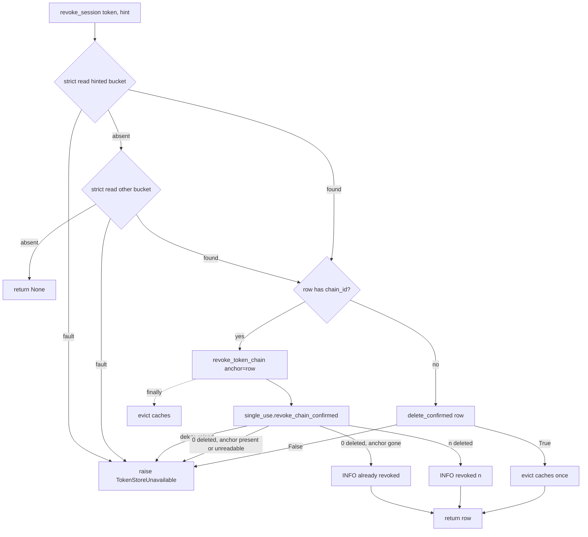

# Implementation Plan: SPA logout and `/oauth/revoke` end the refresh chain

**Date:** 2026-09-29
**Research:** thoughts/research/2026-09-28-logout-does-not-revoke-refresh-chain.md
**Branch:** docs/triage-spa-revoke-chain (implementation branch: `fix/3.15.1-logout-revokes-chain`)
**Release:** 3.15.1 patch

## Overview

`POST /oauth/logout` with an SPA session token deletes only the access-token
row, and `POST /oauth/revoke` deletes only the presented row, so the refresh
chain outlives both, and revoking a used refresh token removes the replay that
would have caught a thief. This plan makes both endpoints end the whole chain
with the fault contract 3.15 set for MCP tokens (a fault keeps the presented
token and answers 503 + `Retry-After`), tags login-minted access tokens with
their chain, fixes the cookie names logout clears, and lets a cross-origin SPA
read `Retry-After`. Riding with it, because they are the same contract in the
same files: the remaining token-store fault-contract gaps in the MCP store
(auth-code lookups, the SDK logout, `revoke_client_tokens` eviction, the
expired-token sweep), two hygiene items in the MCP token manager, and one
missing SPA endpoint test.

It closes, and deletes, `thoughts/todo/logout-does-not-revoke-refresh-chain.md`,
`token-store-fault-contract-gaps.md`, `mcp-logout-fault-path-followups.md`,
`mcp-cleanup-expired-tokens-strict-read.md` and
`spa-session-retrieve-endpoint-test.md`, and trims
`mcp-token-manager-hygiene-followups.md` to its items 2 and 4.

Why now (re-evaluated 2026-09-29 at the owner's request): 3.15 scoped this
out as "different token store, its own todo", rated Medium because a
consumer could call `/oauth/revoke` first. The second consumer report showed
that call deletes one row and, in the theft case, the *used* row, which is
the tripwire; so the workaround is worse than nothing and the Medium rating's
premise is gone. The DynamoDB scan cost that blocked it is now measured. And
the SPA theft response itself is fail-open on PostgreSQL (`delete_by_chain`
returns 0 on a fault, the handler still says "revoked"), so 3.15's fault
contract does not hold on the SPA store. Not fixing it means the guide's
"clear all tokens" stays false and a logged-out session lives out its 14-day
refresh TTL server-side.

## Decisions Made

- **Chain scope, not actor scope**: logout ends one lineage - settled in the
  todo; `create_refresh_token`'s per-device chain design. Known exception,
  pre-existing: `_clear_provider_token_for_actor` nulls the actor's provider
  token for every device (`oauth2_spa.py:1742-1744`); it now runs after a
  confirmed revoke, and the docs name the side effect.
- **Accept the DynamoDB scan; ship as 3.15.1**: settled by the owner
  2026-09-28 from production numbers (42 rows, ~3 RCU, ~0.4 logouts/day).
  Note the 3.15 precedent accepted the scan for a *per-actor* MCP partition;
  this is the first routine scan of the *shared* `OAUTH2_SYSTEM_ACTOR`
  partition, so the plan states a threshold and logs when it is crossed.
  Option 3 (GSI on a promoted `chain_id`) is the named growth path.
- **Fault contract copies MCP**: anchor via `delete_by_chain(defer_name=)`,
  strict read on zero deleted, `TokenStoreUnavailable` → 503 + `Retry-After: 5`,
  presented token kept as the retry handle - 3.15 plan, Iterations 17/20/22.
- **The anchor/strict-read/raise/evict core is shared, not copied** - chosen
  by the owner 2026-09-29 over the architecture evaluator's "copying is
  justified", on the outside voice's point that `single_use.py` exists so
  that "a fix to either reaches both stores". `single_use.revoke_chain_confirmed()`
  holds the core; the 3.15-hardened MCP `_revoke_chain` calls it and keeps
  its index and provider-row cleanup; its existing fault tests must pass
  unchanged.
- **Logout also accepts the refresh token** (POST JSON body `refresh_token`,
  or the `refresh_token` cookie at path `/`) - chosen 2026-09-28. An access
  token expires after 1 h and the expired row is not readable, so logout after
  an idle hour has no chain to scope on otherwise. The guide also documents
  calling `/oauth/revoke` with the refresh token.
- **GET `/oauth/logout` revokes the chain too** - chosen 2026-09-29. The
  security evaluator showed a cross-site top-level GET carries the
  `SameSite=Lax` cookies and can force a logout; the owner accepted it: it
  ends one device's session, exposes nothing, and one behaviour is simpler.
- **An access token presented to `/oauth/revoke` revokes its chain** when it
  has one - RFC 7009 §2.1 MAY; matches the MCP rule.
- **A hint miss falls back to the other bucket; no `unsupported_token_type`**
  - RFC 7009 §2.1: "If the server is unable to locate the token using the
  given hint, it MUST extend its search across all of its supported token
  types", and an invalid hint is ignored (security and usability evaluators;
  the draft's 400 was wrong).
- **`_handle_revoke` reads the `refresh_token` cookie** when the body has no
  token - so a cookie-mode browser can revoke after its access token expired.
- **`OAuth2SPAHandler._handle_logout` is deleted** with its dispatch - it is
  unreachable; the live path takes over its correct cookie list.
- **`OAuth2Server.handle_logout_request` is fixed, not deleted** - the
  outside voice proposed deleting it as a second dead logout; it is a public
  SDK method, and a patch removes no public signature. It maps
  `TokenStoreUnavailable` to `action: "retry"` (todo item 5).
- **`store_access_token` raises `TokenStoreUnavailable` on a failed write**,
  and `_generate_actingweb_token` stops swallowing it - chosen by the owner
  2026-09-29 (outside voice): the login access token becomes the logout
  handle, so a silent no-write must not hand out a token that validates
  nowhere. For the SPA sites A–E the scope is unchanged because
  `create_refresh_token` already raises (`oauth_session.py:602-611`); the www
  cookie login (`oauth2_callback.py:785-787`, no refresh mint) gains a new
  500 on a store fault where it previously handed out an unusable cookie.
- **The WARNING moves to the theft caller**; `revoke_token_chain` logs INFO -
  "behaviour only one caller wants belongs in that caller" (3.15 plan).
- **`Access-Control-Expose-Headers: Retry-After` on logout, revoke and
  `/oauth/spa/token`** - the refresh grant's 3.15.0 503 has the same gap.
- **The CORS builders honour `spa_cors_origins`** - chosen 2026-09-29. Both
  integrations echo any `Origin` with `Allow-Credentials: true` on logout and
  the SPA endpoints, discarding the allowlist the handler computes. The
  default is `["*"]` (`config.py:207`), so only a deployment that called
  `with_spa_cors_origins()` changes, and it changes to what it configured.
- **FastAPI's `/oauth/logout` route always delegates to the handler** and
  passes the handler's status, headers and cookies through
  (`mcp-logout-fault-path-followups.md` item 1) - without it the contract
  fails on every cookie-mode browser logout on FastAPI, and a
  refresh-token-only request never reaches the handler at all.
- **`revoke_token_chain` keeps returning 0 when called without an anchor** -
  it is public; raising there would change its contract in a patch.
- **Bundled todos** - chosen 2026-09-29 after reviewing `todo/INDEX.md`:
  `token-store-fault-contract-gaps.md` item 2, `mcp-logout-fault-path-followups.md`
  items 2, 4, 5, `mcp-cleanup-expired-tokens-strict-read.md`,
  `mcp-token-manager-hygiene-followups.md` items 1 and 3, and
  `spa-session-retrieve-endpoint-test.md`; folded into Phases 1–2 next to the
  SPA change each resembles, not a phase of their own.
- **A legacy chain-less token revokes only itself** - verification
  2026-09-27-refresh-grace-setting-3.
- **Unknown token stays 200 on `/oauth/revoke`** - RFC 7009 §2.2.
- **Each endpoint keeps its existing 503 body shape**; the contract a client
  relies on is the status plus `Retry-After` (logout:
  `{"success": false, "error": "temporarily_unavailable"}`; revoke and
  `/oauth/spa/token`: `_json_error`'s `{"error": true, "status_code": 503}`).

## What We're NOT Doing

- `revoke_all_tokens(actor_id)` on logout - contradicts the per-device chain
  design.
- A GSI on `chain_id` or storing the refresh identity on the access row -
  the owner accepted the scan from measured cost; recorded as the growth path.
- Hybrid sessions whose only refresh cookie came from the provider callback
  (path `/oauth/spa/token`, `oauth2_callback.py:733`) and cross-site
  `SameSite=Lax` fetches - the browser never sends that cookie to
  `/oauth/logout`; documented as a limitation where the consumer's hybrid web
  login will see it (the access token still closes the chain while valid).
- Keeping expired access-token rows readable - rejected in Decision 1.
- Closing the "anchor expires before the retry" window (a DynamoDB partial
  fault whose anchor is a 1-h access token; the surviving refresh rows are
  orphaned to their TTL if the client never retries) - rare on top of rare;
  the guide tells clients to retry a 503 logout promptly and, when they hold
  it, with the refresh token, which anchors on the 14-day row.
- `mcp-token-manager-hygiene-followups.md` item 2 (`aw_proxy` debug logging)
  and item 4 (a pointer to the rotation-ladder plan) - unrelated to token
  stores; the file stays with those two.
- `db-layer-get-bucket-or-empty.md` - six sites across fanout, callbacks and
  remote storage with behaviour decisions each; not a patch rider.
- The FastAPI OPTIONS `*`-plus-credentials mismatch on `/oauth/spa/logout` -
  a separate defect found in research; filed as a todo in Phase 3.
- Making `/oauth/revoke` accept `application/x-www-form-urlencoded` (RFC 7009
  §2.1's request shape) - pre-existing JSON-only contract; out of scope.
- Dispatching `aw_` MCP tokens presented to `/oauth/revoke` to the MCP store -
  pre-existing; no `revocation_endpoint` is advertised, so nothing points MCP
  clients there.
- Removing `revoke_access_token` / `revoke_refresh_token` - public methods;
  they lose their library callers and get a docstring saying they are
  single-row and fault-blind, kept for compatibility.
- A CORS-wrapped 500 for a bug in `_handle_revoke` - the integrations run
  `handler.post` unguarded (`flask_integration.py:1322`); a cross-origin SPA
  sees a network error for a genuine bug, which the guide notes. Same as every
  other SPA endpoint today.
- A migration guide - a patch never touches `docs/migration/`; the changelog
  carries the behaviour notes and quotes the v3.15 guide's "SPA session token
  is unchanged" line so a reader finds the correction.
- Cross-process cache invalidation - `mcp-cache-lifecycle-and-revocation.md`.

## What Already Exists

- `actingweb/db/{dynamodb,postgresql}/attribute.py` `delete_by_chain(defer_name=)`
  - the anchored chain delete on both backends; reused, with a prefix fix,
  a size WARNING and a raise-instead-of-skip added.
- `db.get_attr_strict` - distinguishes absent from fault; reused for the
  session lookup on both endpoints.
- `actingweb/oauth2_server/token_manager.py:686-790` `_revoke_chain` - the
  anchor/strict-read/raise/evict-in-finally pattern; its store-agnostic core
  (`:748-769`, `:788-790`) moves to `single_use.revoke_chain_confirmed()`;
  the index and provider-row cleanup (`:771-786`) stays in the MCP method.
- `actingweb/single_use.py` - "Both live here so a fix to either reaches both
  stores"; `StoreFault` (`:85`), `delete_confirmed` (`:197`, conditional
  delete plus strict read; False for "still there" and "could not look" alike,
  so the caller raises on False with no third read), `_mask` (`:190`).
- `actingweb/oauth2_server/token_manager.py:28` `TokenStoreUnavailable` -
  already raised by `oauth_session.py`; reused. `_strict_read` (`:1130-1150`)
  and `_snapshot_bucket` (`:663-684`, the `Attributes.loaded` check) are the
  shapes the bundled MCP items copy.
- `actingweb/handlers/oauth2_spa.py:1753` `_store_unavailable()` - 503 +
  `Retry-After: 5`; both integrations already forward `Retry-After` on SPA
  endpoints. Reused by `_handle_revoke`.
- `actingweb/handlers/oauth2_endpoints.py:953-965` - the `retry` → 503 path
  of `_handle_logout_request`; the SPA branch only needs to return `retry`.
- `actingweb/handlers/oauth2_endpoints.py:1075-1102` `_handle_mcp_token_logout`
  - a separate method outside the SPA branch's `except Exception`; the SPA
  branch is extracted to the same shape.
- `actingweb/handlers/oauth2_spa.py:1617` `_generate_actingweb_token(chain_id=)`
  and `create_refresh_token(chain_id=)` - both already accept a chain id, so
  login tagging needs no signature change.
- `actingweb/oauth2_server/token_manager.py:233-249` - the chain-first pair
  mint; `new_chain_id()` copies `_new_chain_id`.
- `actingweb/handlers/oauth2_spa.py:1692` `_clear_token_cookies` - the
  correct cookie names, including the second `refresh_token` clear at
  `/oauth/spa/token`.
- `actingweb/handlers/oauth2_spa.py:153-175` `_set_cors_headers` and
  `fastapi_integration.py:2266-2275` - the `spa_cors_origins` allowlist
  logic the integration builders should share.
- `tests/mcp_token_double.py` - `chain_delete_fault` (`zero`/`raise`/`partial`
  with `defer_name`), `faulty_buckets`, `delete_faults`, `cas_hook` (the shape
  for the new `chain_delete_hook`), `ttls` recorded (the base for an
  `enforce_ttl` mode).
- `tests/test_oauth2_logout_mcp_tokens.py:58` - template for the
  fault-then-retry logout test; `:170-178` `_patched_logout(RETRY)` for route
  tests; `:124` `test_sdk_logout_does_not_claim_success_on_a_fault`.
- `tests/test_mcp_token_store_faults.py`, `tests/test_mcp_auth_code_single_use.py`
  - the MCP fault suites the bundled items extend.
- `tests/test_email_verification_legacy_route.py:56-60` - the FastAPI
  `TestClient` setup (with `setup_routes()`) for the new session-retrieve
  test; `tests/test_spa_api_endpoints.py` has no `TestClient`. The session
  manager is faked by patching `get_oauth2_session_manager`, as
  `tests/test_oauth2_logout_mcp_tokens.py:116-119` does.
- `tests/integration/test_oauth2_spa_passphrase.py:20-54` - live-server SPA
  token fixture.
- `tests/test_oauth2_callback_apple.py:262-264` - the callback's session
  manager is a `MagicMock`, so chain linkage at the two callback sites is
  assertable from `call_args.kwargs`.

## Phase 1: Fault-safe chain revocation in both token stores

### Changes

- `actingweb/single_use.py`
  - New `revoke_chain_confirmed(config, partition, buckets, chain_id, *, anchor: tuple[str, str] | None) -> int`:
    `delete_by_chain(partition, buckets, chain_id, defer_name=anchor[1] if anchor else None)`;
    any exception → `StoreFault`; on 0 deleted with an anchor, strict-read it:
    absent → 0 ("already revoked"), present or unreadable → `StoreFault`; on
    0 without an anchor → 0 (callers decide). No logging and no eviction here:
    both stores differ in those.
  - `_mask` becomes the one masking helper; `token_manager._mask_token`
    (`token_manager.py:45`) imports it (hygiene item 3).
- `actingweb/oauth2_server/token_manager.py`
  - `_revoke_chain` (`:686-790`): replace `:748-769` with
    `revoke_chain_confirmed(..., anchor=anchor)` translated to
    `TokenStoreUnavailable`; keep the snapshot, index and provider cleanup,
    the INFO/ERROR lines and the `finally` eviction. The helper returns 0
    for "no anchor", so the MCP wrapper re-adds its own rule "without an
    anchor, 0 is a fault" (ERROR + raise, `:708-709`, `:763-769`) - every
    MCP caller passes an anchor, so nothing pins it today; the wrapper's
    docstring keeps saying it. Behaviour unchanged;
    `tests/test_mcp_refresh_rotation.py:515-535`, `:625-663`, `:702-733` and
    `test_oauth2_logout_mcp_tokens.py:58-83` pin zero/raise/partial/anchor-gone.
  - `revoke_client_tokens` (`:1520-1608`, todo item 2): move
    `evict_caches_for_token(name, actor_wide=False)` into a `finally` around
    each `_remove_access_token`, and call `evict_caches_for_actor(actor_id)`
    once after the loop (before the raise at `:1600-1607`), so a raising
    delete still evicts and the process-wide generation bumps once per
    client, not once per token.
  - `validate_access_token` expired branch (`:296-345`, hygiene item 1): pass
    `actor_id=token_data["actor_id"]` (and the provider key when present) to
    `_remove_access_token`; make the no-`actor_id` fallback (`:1272-1304`)
    read the index once for the actor id, delete the index row first, then
    the actor row with `delete_confirmed`, so the 3.15 index-first invariant
    holds in both branches. Note the return-contract shift: `False` (`:1242-1245`)
    then also covers "still there", which `revoke_token`'s `:563-565` path
    raises on - the intended fail-closed answer.
  - `_search_auth_code_in_actors` (`:930-1000`) and `_load_google_token_data`
    (`:1043-1069`) move here from Phase 2 (`token-store-fault-contract-gaps.md`
    item 2): read through `_strict_read` and let `TokenStoreUnavailable` out
    instead of `except Exception: return None`, as `_load_access_token`
    (`:1125`) does. They move because the sweep below classifies codes with
    the same reader: on a non-strict reader a transient fault reads as `None`
    and the sweep would delete a live code's actor row. In the exchange
    (`token_manager.py:199-223`) the provider-token read moves **before** the
    consume, so a fault there leaves the code unconsumed and the retry works;
    the exchange then answers as the refresh grant's fault already does:
    `handle_token_request`'s generic catch (`oauth2_server.py:481-483`)
    returns `server_error`, which `_handle_token_request` maps to 500
    (`oauth2_endpoints.py:446-448`) - a retryable 5xx instead of
    `invalid_grant` 400 (`tests/test_mcp_token_store_faults.py:1-7`).
    Upgrading `/oauth/token` to 503 + `Retry-After` is not part of this patch.
  - `cleanup_expired_tokens` (`:1610-1745`, its todo): the three index reads
    check `Attributes.loaded` (as `_snapshot_bucket` does) and skip an
    unreadable index with one WARNING; for each index row, keep the strict
    read to classify it (all three readers are strict once the auth-code
    reader above is): live data → the existing branches stay - `expires_at`
    in the past (`:1672-1675`, reachable for an hour because
    `TTL_CLOCK_SKEW_BUFFER = 3600`) and a consumed refresh row past the reuse
    window (`:1699-1708`, pinned by `tests/test_mcp_refresh_rotation.py:357-370`)
    are removed as today, anything else is left; `None` (absent **or**
    TTL-past, which the strict read cannot tell apart) → delete the index row
    **and** the actor row by name from the index row's actor id (the index
    data is the actor id string, `:1115`, `:1338`, `:910`) with
    `delete_confirmed` (a no-op when truly absent, the orphan fix when
    TTL-past-but-present). This is safe because an actor row's TTL is never
    longer than its index row's (index = TTL + `INDEX_TTL_BUFFER`,
    `constants.py:223`; a consume only shortens), so a `None` from a strict
    read never hides a live row - state that invariant in the docstring.
    Catch `TokenStoreUnavailable` per row, count it under `"skipped"`, log
    once, continue. Never delete an actor row on the `None` path without a
    strict read behind it.
- `actingweb/oauth_session.py`
  - `revoke_token_chain(actor_id, chain_id, *, anchor: tuple[str, str] | None = None) -> int`:
    call `revoke_chain_confirmed(config, OAUTH2_SYSTEM_ACTOR, [refresh, access], chain_id, anchor=anchor)`;
    `StoreFault` → `TokenStoreUnavailable`; INFO log for the non-zero and the
    already-revoked cases; `evict_caches_for_actor` in `finally`. Without an
    anchor it returns 0 as today (public contract). Docstring rewritten: login
    access tokens carry the chain (Phase 2), the theft response kills them
    too, the DynamoDB scan is accepted per logout at the measured cost with
    the GSI as growth path.
  - New `new_chain_id() -> str` (`secrets.token_urlsafe(16)`), used by
    `create_refresh_token`'s default and by the Phase 2 login sites.
  - New `revoke_session(token, *, token_type_hint: str = "access_token") -> dict[str, Any] | None`:
    strict-read the row in the bucket the hint names, and on a miss in the
    other bucket (RFC 7009 §2.1; an unrecognised hint means access first). A
    read fault raises `TokenStoreUnavailable`. `None` → return `None`
    (unknown or expired). With a `chain_id` →
    `revoke_token_chain(actor_id, chain_id, anchor=(bucket, token))` (which
    evicts in its `finally`); without → `delete_confirmed(...)`, raising
    `TokenStoreUnavailable` on False, then `evict_caches_for_actor(actor_id)`
    once. Returns the row's data (`actor_id`, `identifier`, `chain_id`, …) so
    callers clear the provider token *after* a confirmed revoke without a
    second, non-strict read. This is the one entry point revoke and logout
    call.
  - `store_access_token` (`:431-474`): raise `TokenStoreUnavailable` when
    `set_attr` answers False, as `create_refresh_token` does; docstring:
    `chain_id` is set at login and rotation, None only for the www cookie
    token.
  - `revoke_access_token` / `revoke_refresh_token` docstrings: single-row,
    fault-blind, kept for compatibility; library paths use `revoke_session`.
- `actingweb/handlers/oauth2_spa.py`
  - Theft branch (`:714-740`): call
    `revoke_token_chain(actor_id, chain_id, anchor=(_REFRESH_TOKEN_BUCKET, refresh_token))`
    inside `try/except TokenStoreUnavailable → return self._store_unavailable()`;
    the chain-less legacy fallback at `:732` goes through
    `revoke_session(refresh_token, token_type_hint="refresh_token")` with the
    same catch, so it stops answering "revoked" over an unconfirmed delete.
    Keep the branch's own WARNING (now the only WARNING for theft).
  - `_generate_actingweb_token` (`:1617-1641`): drop the `except Exception`
    that returns an unstored token; let `TokenStoreUnavailable` propagate.
- `actingweb/db/dynamodb/attribute.py:376-426` `delete_by_chain`:
  `startswith(bucket + ":")` (the delimiter `get_bucket` at `:74` and
  `delete_bucket` at `:345` use; a prefix-sibling bucket is read today and
  discarded at `:414`); a failure to build the query raises instead of
  `continue` (`:409-410`, otherwise a non-zero count from the other bucket
  hides a skipped bucket); iterate the query and count rather than `list()`
  it; `logger.warning` once per call when a bucket's rows exceed
  `CHAIN_SCAN_WARN_ROWS = 1000`, naming the bucket and the GSI path. Docstring
  (`:381-385`): replace "Revocation is rare (a theft event)" with: routine on
  SPA logout and revoke; acceptable while the two SPA buckets together stay
  under ~1 MB (~3,000 rows, one page each, ≤ ~250 RCU per call); beyond that
  the `chain_id` GSI is due. Same note in `db/protocols.py:1224-1226`.
- `actingweb/db/dynamodb/attribute.py:176-179`, `:308-312` and
  `actingweb/db/postgresql/attribute.py:381-384`, `:544-547`: one
  `ttl_timestamp(ttl_seconds)` helper per backend module for the
  `now + ttl + TTL_CLOCK_SKEW_BUFFER` stamp (hygiene item 3).
- `tests/mcp_token_double.py`: `chain_delete_hook: Callable[[], None] | None`
  run inside `delete_by_chain` before rows are touched (the `cas_hook`
  shape); `delete_by_chain` emulates the `":"` prefix; an `enforce_ttl: bool`
  mode under which `get_attr_strict` treats a row whose deadline has passed
  as absent while `get_bucket` still lists it (the real backends' shape).
  `store.ttls` keeps recording *relative* seconds (tests assert those values,
  `test_mcp_refresh_rotation.py:86-87`, `test_mcp_auth_code_single_use.py:89-95`);
  the mode adds a separate `deadlines` dict of absolute timestamps and a
  `clock` the test can advance.
- `tests/test_oauth_session.py:132`: the local mock's `delete_by_chain` gains
  `defer_name=None`.

### New Tests, both unit and integration tests

- `tests/test_oauth2_spa_refresh_rotation.py` (on the double):
  - theft with `chain_delete_fault="zero"` answers 503 + `Retry-After: 5`, the
    presented used token is still in the store, and a second presentation
    revokes the chain.
  - `chain_delete_fault="raise"` → 503, chain intact.
  - `chain_delete_fault="partial"` → 503; the anchored (presented) row
    survives, the retry finishes the chain.
  - `chain_delete_fault="zero"` plus `chain_delete_hook` adding the refresh
    bucket to `faulty_buckets` → the anchor read faults → 503.
  - `chain_delete_fault="zero"` plus `chain_delete_hook` popping the anchor
    row → 401 "revoked" (concurrent revocation), no 503.
  - legacy chain-less reuse with `delete_faults` on the row → 503, row kept.
  - Eviction ran on the fault path (spy on
    `actingweb.mcp.invalidation.evict_caches_for_actor`).
- `tests/test_oauth_session.py`: `revoke_session` with a chain-tagged access
  token removes both tokens and returns the row; with a chain-less refresh
  token removes only that row; unknown token returns `None`; a refresh token
  under the default `access_token` hint is found by the fallback read;
  `delete_faults` on the chain-less row raises `TokenStoreUnavailable`;
  `revoke_token_chain` without an anchor still returns 0 on `zero`;
  `delete_by_chain` is called once when `revoke_session` handles a chain
  (eviction counted once); `store_access_token` raises on `write_faults`.
- `tests/test_single_use.py` (or the existing single-use suite):
  `revoke_chain_confirmed` on the double for `zero`/`raise`/`partial`, anchor
  present, anchor gone, no anchor.
- `tests/test_mcp_token_store_faults.py` (existing MCP suite, extended):
  `_revoke_chain` behaviour unchanged after the extraction (the existing
  cases pass); `revoke_client_tokens` with `delete_faults` on one token still
  evicts that token's cache entry and bumps the generation once per call;
  `validate_access_token` on an expired row deletes the index row first with
  one read; `cleanup_expired_tokens` under `enforce_ttl` removes a TTL-past
  access row's actor row and index row, removes a consumed refresh row past
  the reuse window, **leaves a live row and its index untouched**, skips and
  counts a row whose bucket is in `faulty_buckets` and finishes the sweep,
  and reports an unreadable index as skipped rather than empty; a live auth
  code survives a sweep run with a transient fault on its bucket (the F3
  regression). `_revoke_chain` with `chain_delete_fault="zero"` plus
  `chain_delete_hook` faulting the anchor read raises (the MCP counterpart of
  the SPA hook test).
- `tests/test_mcp_auth_code_single_use.py` / `test_oauth2_token_endpoint_errors.py`:
  `faulty_buckets` on the auth-code index and, separately, on the
  provider-token bucket during a code exchange → 500 `server_error` (not
  `invalid_grant`), and the code is still exchangeable afterwards in both
  cases (the provider read now precedes the consume).
- A unit test on the double that seeds `CHAIN_SCAN_WARN_ROWS + 1` rows and
  asserts the WARNING record; and one that a bucket named
  `spa_access_tokens_x` is not read.
- `tests/integration/test_spa_chain_revocation_backend.py` (new, mirrors
  `test_mcp_refresh_rotation_backend.py:143`): on the real backend, an
  anchored `delete_by_chain` over the SPA buckets under `OAUTH2_SYSTEM_ACTOR`
  deletes the whole chain and only that chain, leaves another chain's rows,
  and the deferred row goes last (DynamoDB). Clean up by name, never by
  bucket.

### Failure Scenarios

- `delete_by_chain` raises mid-scan on DynamoDB - presented token deferred to
  last, survives; 503 - covered by the `partial` test.
- PostgreSQL delete fails silently (returns 0) - anchor still present →
  raise; 503 - covered by the `zero` test.
- Strict anchor read faults after a zero delete - raise; 503 - covered by the
  hook test.
- Concurrent revocation already emptied the chain - anchor absent → treated
  as done, no false 503 - covered by the hook test.
- Cache eviction skipped on a raise - `finally` - covered by the spy test.
- A DynamoDB query for one bucket cannot be built - raise, not skip -
  covered by the raise path of `revoke_chain_confirmed`.
- Login-time access-row write fails - `TokenStoreUnavailable` propagates, no
  half-minted pair - covered by the `write_faults` test.
- The shared partition grows past a page - WARNING names the bucket and the
  GSI path; behaviour unchanged - covered by the seeded-rows test.
- The sweep meets one unreadable row - skipped, counted, sweep continues -
  covered by the `faulty_buckets` sweep test.

### Verification

- [ ] Run the contract's `### Checks` fast tier verbatim
- [ ] Run `tests/integration/test_spa_chain_revocation_backend.py` and
      `tests/integration/test_mcp_refresh_rotation_backend.py` on both backends

### Implementation Status: Complete

**Notes (2026-09-29):**

- Fast tier green (2,820 passed); the two backend integration files pass on
  DynamoDB and PostgreSQL. The full tier runs once at the end, not per phase,
  because nothing is committed between phases in this run.
- Deviation: the per-backend TTL helper is named `ttl_deadline`, not
  `ttl_timestamp`, because `ttl_timestamp` is a local variable in
  `set_attr` and a field on the DynamoDB model.
- `_search_auth_code_in_actors` reuses `_search_indexed_token` (the shape the
  access and refresh lookups already use) instead of a bespoke strict reader.
- `cleanup_expired_tokens` now returns a `skipped` key (always present, 0 when
  nothing was skipped); the sweep lives in one `_sweep_index` helper for the
  three indexes. Changelog: name the new key.
- The DynamoDB scan-warning and sibling-bucket tests stub `Attribute.query`
  (`tests/test_dynamodb_delete_by_chain.py`) rather than the in-memory double,
  since they pin the real backend's query shape. The double's `delete_by_chain`
  already matches buckets exactly, so it needed no prefix emulation.
- No breaking existing test appeared in Phase 1; the three the plan expected to
  break belong to Phase 2 (`revoke_session` in the logout mock).
- Release impact: nothing in Phase 1 adds a route, hook, kwarg or config
  option. `revoke_token_chain` gains a keyword-only `anchor=` with a default
  and `store_access_token` now raises, both patch-compatible per the plan.

---

## Phase 2: Login tagging, `/oauth/revoke`, `/oauth/logout`, and the SDK logout

### Changes

- **Login tagging (chain first, then both mints)**
  - `actingweb/handlers/oauth2_callback.py:710-719` and `:1240-1246`:
    `chain_id = session_manager.new_chain_id()`; pass to
    `store_access_token(..., chain_id=chain_id)` and
    `create_refresh_token(..., chain_id=chain_id)`.
  - `actingweb/handlers/oauth2_spa.py:967-972`, `:1123-1128`, `:1367-1372`:
    same, through `_generate_actingweb_token(..., chain_id=chain_id)`.
  - `oauth2_callback.py:785-787` (www cookie token) stays chain-less.
- **`/oauth/revoke`** - `actingweb/handlers/oauth2_spa.py:1404-1482`
  `_handle_revoke`:
  - Token source: body `token`; else Bearer header; else the `refresh_token`
    cookie (hint becomes `refresh_token`); else the `access_token` /
    `oauth_token` cookie.
  - `row = session_manager.revoke_session(token, token_type_hint=hint)`; when
    `row` has an `actor_id`, `_clear_provider_token_for_actor(actor_id)`
    (after the confirmed revoke, not before).
  - `except TokenStoreUnavailable → return self._store_unavailable()` with
    no cookies cleared. The blanket `except Exception` (`:1473-1474`) is
    removed so a bug surfaces as a framework 500 instead of a false 200
    (`_clear_provider_token_for_actor` has its own catch-all, `:1731-1751`).
  - Unknown token: still 200 `{"success": true}` and cookies cleared.
- **`/oauth/logout`** - `actingweb/handlers/oauth2_endpoints.py`:
  - Extract the SPA branch of `_handle_provider_token_logout` (`:1029-1073`)
    into `_handle_session_token_logout(token: str | None, refresh_token: str | None) -> dict`,
    a sibling of `_handle_mcp_token_logout` **outside** the branch's
    `except Exception` (`:1061-1073`), which would otherwise swallow
    `TokenStoreUnavailable` into `success`. It calls
    `revoke_session(token)` then, when given,
    `revoke_session(refresh_token, token_type_hint="refresh_token")` (one
    GetItem when both share a chain, since the first revoke removed the row);
    clears the provider token from the returned row's `actor_id`; maps
    `TokenStoreUnavailable` → `{"action": "retry", ...}` exactly as the MCP
    branch; returns `success` with the corrected cookie list.
  - `_handle_logout_request` (`:867-1003`) additionally collects
    `refresh_token`: on POST from a JSON body when the content type is JSON
    (absent, empty, non-JSON or form bodies are ignored, never a 400; a form
    field `refresh_token` in `values` is accepted), and on any method from
    the `refresh_token` cookie. With no access token but a refresh token, the
    refresh token alone drives the revoke. Both present and different chains
    → both revoked.
  - `clear_cookies` becomes a list of `(name, path)`:
    `access_token`, `oauth_token`, `refresh_token`, `session_id` at `/` and
    `refresh_token` at `/oauth/spa/token`; the clearing loop (`:971-985`)
    uses the path. `oauth_refresh_token` is dropped everywhere (`:917-918`,
    `:947-948`, `:1057`, `:1071`, `:1100`; `oauth2_server.py:780`, `:792`).
    The response's `cleared_cookies` field lists names as today.
  - The outer catch-all at `:936-951` stays for genuine bugs; it no longer
    sees `TokenStoreUnavailable`. **[Updated 2026-09-29, Iteration 1]** It
    now answers 500 and clears no cookie instead of 200 "Logged out (token
    revocation failed)" with the cookies cleared.
- **SDK `OAuth2Server.handle_logout_request`** (`oauth2_server.py:724-797`,
  todo item 5): catch `TokenStoreUnavailable` around **both**
  `validate_access_token` (`:743`, which raises it too) and `revoke_token`
  inside the inner `try` (`:742-773`), before the generic `except`, and
  return `{"action": "retry", "message": ..., "retry_after": 5}` with no
  `clear_cookies`; the cookie lists take the Phase 2 names.
- **MCP auth-code readers**: moved to Phase 1 (the sweep depends on them).
- **FastAPI `/oauth/logout` route** - `fastapi_integration.py:750-829`:
  always delegate to `_handle_oauth2_endpoint(request, "logout")` (the
  handler already answers a token-less request with 200 and a `message`,
  `oauth2_endpoints.py:911-921`, which the consumer's
  `test_logout_endpoint_without_session` pins). Return the handler's response
  as is (status, `Retry-After`, `Set-Cookie`) for AJAX and for every failure;
  keep the non-AJAX 302 to `/` only when the request carried the
  `oauth_token` cookie and the handler answered success, copying the
  handler's `Set-Cookie` headers onto the redirect. `_logout_outcome` keeps
  its 2-tuple contract (used only for the redirect decision), so
  `tests/test_oauth2_logout_mcp_tokens.py:252-266` stands. This also serves
  the www UI (`oauth2_callback.py:792`, `oauth_email.py:643` set
  `oauth_token`; the demo posts non-AJAX, `aw-actor-www-root.html:221-224`):
  a chain-less www token goes through `delete_confirmed` and a fault now
  answers 503 instead of a 302 - named in the changelog.
- **Delete `OAuth2SPAHandler._handle_logout`** (`oauth2_spa.py:1484-1550`)
  and its dispatch (`:237-238`).
- `tests/test_oauth2_logout_mcp_tokens.py:112-123`: assert `revoke_session`
  was called (the MagicMock's `revoke_access_token` no longer is); `:124`
  asserts `action == "retry"` as well as the message.

### New Tests, both unit and integration tests

- `tests/test_oauth2_spa_logout_revokes_chain.py` (new, on the double):
  - login tagging: for the passphrase, `authorization_code` (stubbed
    provider) and native-session sites, assert on the double's store that the
    access row's `chain_id` equals the refresh row's and is not None; for the
    two callback sites, on the `MagicMock` session manager assert
    `store_access_token.call_args.kwargs["chain_id"] == create_refresh_token.call_args.kwargs["chain_id"] is not None`
    (site A, the SPA-JSON return at `oauth2_callback.py:700`, gets a test of
    its own; none exists today).
  - logout with the login access token → refresh token presented to
    `/oauth/spa/token` answers 401; rotated session likewise; legacy
    chain-less access token → only that row gone, the actor's other chain
    intact; GET with the cookie → chain gone.
  - logout with the access row deleted outright (models the TTL sweep) plus
    `refresh_token` in a JSON body → chain gone; same via the `refresh_token`
    cookie; a form body and an empty body do not 400; both tokens from one
    chain → `delete_by_chain` called once.
  - logout on `chain_delete_fault="zero"` → 503, `Retry-After: 5`, no
    `Set-Cookie`, tokens still present, provider token not cleared; retry
    succeeds; success clears the five `(name, path)` pairs.
  - `/oauth/revoke`: a used refresh token revokes the chain's newest token;
    an access token with a chain revokes the chain; chain-less refresh token
    revokes only itself; unknown token → 200; refresh token under the default
    hint is found; fault → 503 + `Retry-After`, token still works for the
    retry, no `Set-Cookie`; `refresh_token` cookie read when the body has none.
  - `handler.post("logout")` on `OAuth2SPAHandler` → 404 "Unknown SPA
    endpoint" (replaces the draft's grep guard).
- `tests/test_oauth2_logout_mcp_tokens.py`: FastAPI route tests with
  `_patched_logout(RETRY)`: `oauth_token` cookie AJAX → 503, `Retry-After`,
  no cookie deletion; cookie non-AJAX (POST, no content type) → 503 JSON, no
  302; `refresh_token` cookie only → handler reached; success with the
  cookie → 302 carrying the handler's `Set-Cookie`. Flask counterpart for the
  refresh-only and success shapes. Plus one route test per integration with a
  **real** token manager on the double and `chain_delete_fault="zero"`,
  including the cookie-plus-bearer request (todo item 4).
- (The auth-code reader tests move to Phase 1 with the change.)
- `tests/test_spa_session_retrieve.py` (new, FastAPI `TestClient`, its todo):
  pending email session → 404; success session → 200 with the token; second
  GET inside `OAUTH_SESSION_RETRIEVE_GRACE` → 200; stamped outside the window
  → 404; an `Origin` outside `spa_cors_origins` gets the allowlist's origin.
- `tests/integration/test_oauth2_spa_logout.py` (new, both backends): passphrase
  login → `/oauth/logout` with the access token → refresh token 401; login →
  `/oauth/revoke` with the refresh token → 401; login → rotate → revoke the
  used token → the new token 401; login → `/oauth/logout` with only
  `refresh_token` in the body → 401; a second passphrase login (another
  chain) survives all of them.
- Existing suites must pass unchanged, in particular
  `test_oauth2_spa_refresh_rotation.py:179` (legacy chain-less reuse) and
  `test_mcp_revocation_evicts_caches.py:278`.

### Failure Scenarios

- Logout lookup faults (`get_attr` returned None today) - strict read raises →
  `retry` 503, cookies kept, provider token kept - covered by the fault route
  tests.
- Access token expired at logout, no refresh token sent - chain survives; the
  documented limitation; the body/cookie path covers clients that send it -
  covered by the deleted-access-row tests.
- FastAPI AJAX logout on a fault - previously 200 + cookie deleted - now 503,
  cookie kept - covered.
- A client sends a refresh token from another chain - that chain is revoked;
  a holder of the token may do that through `/oauth/revoke` anyway - no new
  exposure; noted in the handler docstring.
- Revoke of an unknown token during an outage - strict read raises → 503,
  not a false 200 - covered.
- Malformed logout body from an old client - ignored, logout proceeds -
  covered by the form/empty-body tests.
- A fault while a code is being exchanged - 500 `server_error`, code kept
  (Phase 1 moved the provider read before the consume), instead of
  `invalid_grant` and a redone consent - covered by the Phase 1 auth-code
  fault tests.
- The sweep meets a transient fault on a live code's bucket - `skipped`, not
  deleted (strict reader raises; the sweep only deletes on a confirmed
  `None`) - covered by the live-code sweep test.
- An SDK caller branching on `action` - gets `retry`, clears no cookies -
  covered by the extended SDK test.

### Verification

- [ ] Run the contract's `### Checks` fast tier verbatim
- [ ] `make test-integration` on DynamoDB and PostgreSQL for the two new
      integration files

### Implementation Status: Complete

**Notes (2026-09-29):**

- Fast tier green (2,870 passed, 0 pyright warnings). The two new integration
  files (`test_oauth2_spa_logout.py`, plus `test_oauth2_flows.py` and the
  passphrase suite that share the routes) pass on DynamoDB and PostgreSQL.
- `_handle_provider_token_logout` now takes `(token, refresh_tokens)` and routes
  MCP vs session; the extracted `_handle_session_token_logout` takes a *list*
  of refresh tokens (body and cookie can name two different ones, and the guide
  says both are revoked), where the plan sketched a single `refresh_token`.
- `clear_cookies` entries are `(name, path)` tuples inside the handler; a bare
  name (used by the existing route tests' patched outcomes) is read as path `/`.
  `cleared_cookies` in the response stays a de-duplicated list of names:
  `access_token`, `oauth_token`, `refresh_token`, `session_id`. The SDK
  `OAuth2Server.handle_logout_request` returns the same four names.
- The FastAPI route needed no CORS rework here: `_handle_oauth2_endpoint`
  already echoes the origin with credentials for logout, merges the handler's
  headers (so `Retry-After` and the corrected `Set-Cookie` pass through) and
  copies its cookies. The route now always delegates and only the non-AJAX
  `oauth_token` success case is turned into a 302, copying Set-Cookie and
  `Access-Control-*` headers onto the redirect.
- Behavior change to name in the changelog: a token-less logout on FastAPI used
  to answer `{"message": "No active session to logout"}` from the route and now
  answers the handler's `{"success": true, "message": "Successfully logged out"}`
  with the cookies cleared (the plan's `test_logout_endpoint_without_session`
  pin holds: 200 plus a message).
- The site A callback test (`tests/test_oauth2_callback_spa_json_chain.py`) and
  the tagging assertions on the three existing mocked-session-manager tests
  cover the two callback sites; the passphrase site is asserted on the double.
- Existing tests changed as the plan predicted: the three logout tests in
  `test_oauth2_logout_mcp_tokens.py` (session-store call, SDK message, the two
  FastAPI cookie-branch tests that asserted the rebuilt response).

---

## Phase 3: CORS, documentation, changelog, todo bookkeeping

### Changes

- A shared `spa_cors_headers(config, origin) -> dict[str, str]` (module-level,
  next to the handler's `_set_cors_headers` logic at `oauth2_spa.py:153-175`)
  that honours `spa_cors_origins` and includes
  `Access-Control-Expose-Headers: Retry-After`; used by
  `flask_integration.py:1279-1298` (logout) and `:1353-1360` (SPA endpoints),
  `fastapi_integration.py:764-772` and `:2126-2137` (logout), `:2209-2230`
  (SPA endpoints), and `:2266-2275` (already allowlist-aware).
- `docs/guides/spa-authentication.rst`: `:205-207` becomes true ("revokes the
  session's refresh-token chain"); the logout example (`:931-950`) and the
  complete example's `logout()` (`:1099-1110`) send the refresh token when the
  client holds one, retry a 503 promptly, and **clear local tokens only after
  a 2xx** (RFC 7009 §2.2.1: on 503 "the client must assume the token still
  exists"); the Token Revocation section (`:964-981`) says a refresh-token
  revoke ends the chain and shows 503 handling; a JSON-mode native pattern
  collapses the separate revoke-then-logout into one logout call; the
  hybrid/cross-site cookie limitation goes in "Hybrid Mode" (`:487`) and
  beside the complete example; the API reference for `/oauth/revoke`
  (`:1379-1400`) and `/oauth/logout` (`:1432-1447`) gains the 503 response
  with each endpoint's actual body, the `refresh_token` request field,
  body-vs-cookie precedence (both are revoked), and a note that logout clears
  the actor's stored provider token for every device.
- `docs/reference/security.rst:55-58`: logout and revoke end the chain; the
  DynamoDB per-call cost, the WARNING threshold and the GSI growth path.
- `CHANGELOG.rst` `Unreleased`, `SECURITY` (lead with the fail-open SPA theft
  response) and `FIXED`; **Behavior change:** sentences for: chain revocation
  on logout and revoke (all session-token logouts, www UI included); the
  theft response now killing the login access token; an access token now
  being a chain-revoke handle; the new 503 on `/oauth/revoke` and on
  session-token `/oauth/logout` (quoting the v3.15 guide's "SPA session token
  is unchanged" as superseded); the cookie names; the `refresh_token` logout
  field and cookie read on both endpoints; `/oauth/revoke` no longer
  swallowing exceptions; FastAPI cookie-branch logout answering JSON 503
  instead of a 302 on a fault and deleting all session cookies on success;
  the hint fallback; `revoke_token_chain` WARNING → INFO and its `anchor=`;
  `store_access_token` raising on a failed write; new `revoke_session` and
  `new_chain_id` (ADDED); CORS honouring `spa_cors_origins` and exposing
  `Retry-After` (also on `/oauth/spa/token`); the per-logout partition scan
  as an operations note; and, for the bundled items: the token endpoint
  answering `server_error` (500) instead of `invalid_grant` on a lookup
  fault during a code exchange (and correcting the 3.15.0 entry at
  `CHANGELOG.rst:308-310`, which says the SPA grant answers 503 "as
  `/oauth/token` does" - `/oauth/token` answers `server_error`),
  `handle_logout_request` answering `retry`, `cleanup_expired_tokens`
  removing TTL-past rows and surviving a fault (with the new `skipped`
  count), and `revoke_client_tokens` evicting once per client.
- `thoughts/todo/`: delete `logout-does-not-revoke-refresh-chain.md`,
  `token-store-fault-contract-gaps.md`, `mcp-logout-fault-path-followups.md`,
  `mcp-cleanup-expired-tokens-strict-read.md` and
  `spa-session-retrieve-endpoint-test.md`; trim
  `mcp-token-manager-hygiene-followups.md` to items 2 and 4; add
  `spa-logout-options-wildcard-with-credentials.md` for the FastAPI OPTIONS
  defect; update `INDEX.md` rows and the `db-layer-get-bucket-or-empty.md`
  row's mention of the 3.15 `loaded` consumer.

### New Tests, both unit and integration tests

- `tests/test_spa_token_retry_after.py`: `Access-Control-Expose-Headers`
  contains `Retry-After` on `/oauth/spa/token` 503, `/oauth/revoke` 503 and
  `/oauth/logout` 503, Flask and FastAPI; with `with_spa_cors_origins("https://a")`
  an `Origin: https://b` gets `https://a`, not `https://b`; default config
  still echoes.
- `tests/integration/test_oauth2_flows.py::TestOAuth2CORSPreflight`: the
  header is present on logout with and without an `Origin`.
- Docs build (`sphinx-build -W`).

### Failure Scenarios

- A proxy strips `Access-Control-Expose-Headers` - the client falls back to
  a fixed retry delay; the guide says so - handling by documentation.
- A deployment configured `spa_cors_origins` without its real SPA origin -
  the browser now blocks the response it previously got; the changelog names
  it - handling by documentation.

### Verification

- [ ] Run the contract's `### Checks` full tier verbatim
- [ ] `poetry run sphinx-build -W ...` passes
- [ ] Re-read `thoughts/README.md` before deleting the todos

### Implementation Status: Complete

**Notes (2026-09-29):**

- `spa_cors_headers(config, origin, *, methods=...)` lives in
  `handlers/oauth2_spa.py` and replaces five hand-built blocks: the handler's
  own `_set_cors_headers`, Flask's logout and SPA-endpoint branches, and
  FastAPI's logout preflight, logout response and SPA-endpoint response. It also
  replaced the session-retrieve block (`methods="GET, OPTIONS"`), which already
  honoured the allowlist. The unit test for the allowlist had to go through
  `ActingWebApp.with_spa_cors_origins()`: `get_config()` re-stamps
  `spa_cors_origins` from the app on every call.
- The OPTIONS defect was confirmed with a probe on both integrations: FastAPI
  `OPTIONS /oauth/spa/logout` answered `*` with credentials and lacked
  `Accept`; Flask answered the echoed origin. It was first filed as a todo,
  then fixed in this release (see the summary).
- Changelog headlines carry no inline literals (RST does not nest a literal in
  bold); the 3.15.0 entry's "as `/oauth/token` does" is corrected by a
  sentence in the 3.15.1 FIXED entry rather than by editing the shipped entry.
- Todo bookkeeping: deleted `logout-does-not-revoke-refresh-chain.md`,
  `token-store-fault-contract-gaps.md`, `mcp-logout-fault-path-followups.md`,
  `mcp-cleanup-expired-tokens-strict-read.md` and
  `spa-session-retrieve-endpoint-test.md`; trimmed
  `mcp-token-manager-hygiene-followups.md` to its two remaining items
  (renumbered 1 and 2); `INDEX.md` updated, including
  the `db-layer-get-bucket-or-empty.md` row's note on who consumes
  `Attributes.loaded`.
- `/oauth/revoke` answers 400 for a JSON body that is not an object. The old
  blanket catch turned that into a false 200; with the catch gone it would have
  been a framework 500.
- Docs build (`sphinx-build -W`) passes.

---

## Evaluation Notes

### Architecture
- High: FastAPI's inline `/oauth/logout` (`fastapi_integration.py:790-829`)
  reaches the handler only with an `oauth_token` cookie or Bearer header →
  the route now always delegates.
- The SPA branch's own `except Exception` (`oauth2_endpoints.py:1061-1073`)
  would swallow `TokenStoreUnavailable` → extracted to a sibling method like
  the MCP branch.
- `_logout_outcome` re-derives and discards status/headers/cookies → the route
  returns the handler response; the helper is kept only for the redirect
  decision.
- `revoke_access_token`/`revoke_refresh_token` lose their callers → kept
  public with docstrings; the theft legacy fallback routes through
  `revoke_session`.
- Provider clearing before the revoke forced a double read and a
  half-logged-out retry → `revoke_session` returns the row; clearing happens
  after.
- The www UI shares the FastAPI cookie branch → named in the changelog and
  the route test matrix.
- Body parsing on GET → JSON body read on POST only; cookie on any method.
- Two 503 body shapes → recorded as a decision; status + `Retry-After` is the
  contract.

### Security
- GET + Lax cookies cross-site forced logout → owner accepted chain revoke on
  GET.
- `unsupported_token_type` mis-cited RFC 7009 → dropped; hint miss falls back.
- Access token as a chain-revoke handle → changelog line.
- Echo-any-Origin with credentials → owner chose to honour `spa_cors_origins`
  in Phase 3.
- The 503 paths must not clear cookies → the extraction removes the ordering
  trap; the no-`Set-Cookie` assertion is in the tests.

### Scalability
- Threshold and WARNING added to `delete_by_chain`; docstrings state ~3,000
  rows / 1 MB per bucket; the shared-vs-per-actor distinction recorded.
- `startswith(bucket)` → `bucket + ":"`.
- Double eviction removed (chain branch evicts in `finally` only).
- Both tokens from one chain cost one scan (second call is a GetItem), pinned
  by a test.
- Generation bump per logout: pre-existing, one per logout after
  de-duplication.

### Usability
- `clear_cookies` gains a path so the `/oauth/spa/token` clear is expressible.
- Guide states "clear local tokens only after 2xx" in both examples; the
  consumer's current code clears regardless of status.
- Hybrid limitation placed in "Hybrid Mode" and the complete example.
- Lenient body parsing; body-vs-cookie precedence documented.
- Changelog list extended with the nine omissions.

### Tests and code quality
- `chain_delete_hook` added to the double so the anchor-fault and anchor-gone
  cases are reachable; three breaking existing tests named and handled.
- `revoke_token_chain` keeps returning 0 without an anchor.
- `delete_confirmed` raise-on-False, no third read.
- Grep-guard test replaced with `post("logout")` → 404.
- Expired-access test deletes the row outright.
- Site A of the callback gets its own test.

### Outside voice
Codex ran (unsandboxed, within the 300 s limit) with a fresh-context Claude
on top. Taken: `store_access_token` raises on a failed write and
`_generate_actingweb_token` stops swallowing (login handle must exist);
DynamoDB `delete_by_chain` raises instead of skipping a bucket; the
store-agnostic revoke core moves to `single_use.revoke_chain_confirmed()`
per that module's own charter; the provider-token clear's actor-wide side
effect is recorded as a known exception to chain scope and documented; the
CORS-less 500 for a genuine bug is noted in the guide; the "anchor expires
before the retry" window is recorded under What We're NOT Doing with the
guide's mitigation. Not taken: deleting `OAuth2Server.handle_logout_request`
(public SDK method; a patch removes no public signature) - it is fixed per
todo item 5 instead. Verdict on the vehicle: 3.15.1 stands; the changelog
carries the response-field and 503 changes.

### Tests and code quality, second pass (bundled items)
Run after the todo-index review added the MCP items, on those items only.
Taken: the sweep must not delete on a `None` from a non-strict reader (the
auth-code readers move to Phase 1, and the sweep's safety invariant - actor
TTL ≤ index TTL - is stated); the sweep keeps its two live-row branches
(`test_mcp_refresh_rotation.py:357-370` pins one); the provider-token read
moves before the consume so a fault leaves the code exchangeable; the double's
`enforce_ttl` uses absolute deadlines and a clock, not the relative `ttls`
the tests assert; the MCP `_revoke_chain` wrapper re-adds "no anchor is a
fault" and gets the hook test; the SDK logout catch wraps
`validate_access_token` too; the session-retrieve test copies
`test_email_verification_legacy_route.py`, not `test_spa_api_endpoints.py`;
the `validate_access_token` fallback reads the index for the actor id before
deleting it, and its return-contract shift is named. Corrected in the plan
text: the token endpoint answers `server_error` 500 on a fault, not 503 (my
own uncited claim; the 3.15.0 changelog carries the same error at `:308-310`
and Phase 3 corrects it).

### Unverified notes
- The `_generate_actingweb_token` write-failure swallow
  (`oauth2_spa.py:1638-1639`) is removed in Phase 1; the tagging tests assert
  on the store regardless.
- A thief holding a used-within-window refresh token can end the chain at
  INFO through `/oauth/revoke` instead of tripping the theft WARNING -
  observability only, same outcome.
- The 3,000 RCU/s per-partition figure is from memory of AWS docs; the
  threshold does not depend on the exact number.
- The RFC 7009 §2.1 "MUST extend its search" sentence was fetched by the
  usability evaluator; the security evaluator quoted it from memory. Confirm
  wording before it enters the changelog.
- `_clear_provider_token_for_actor` never nulls `actor.store.oauth_refresh_token`
  (login writes it at `oauth_session.py:370`, `oauth2_callback.py:578`,
  `:1190`, `oauth2_spa.py:930`, `:1088`); whether anything refreshes a
  provider token from it after logout is for the implementer to check.
- DynamoDB `defer_name` matches by name across both buckets
  (`dynamodb/attribute.py:418`); harmless given distinct token formats.

## Implementation Summary

**Completed:** 2026-09-29
**All phases:** Complete
**Test status:** All passing (see the Full tier line below)

### Deviations from Plan
- The per-backend TTL helper is `ttl_deadline`, not `ttl_timestamp` (a local
  variable and a model field already carry that name).
- `_handle_session_token_logout` takes a list of refresh tokens, not one: the
  body and the cookie can name different tokens and the guide says both are
  revoked.
- `_search_auth_code_in_actors` reuses `_search_indexed_token` instead of a
  bespoke strict reader.
- `cleanup_expired_tokens` returns a `skipped` key on every call, and the three
  index sweeps share one `_sweep_index` helper.
- `/oauth/revoke` answers 400 for a non-object JSON body (not in the plan).
- The FastAPI route needed no CORS-header rebuild for the handler response:
  `_handle_oauth2_endpoint` already merges the handler's headers, so the route
  only decides the 302 and returns the response otherwise.
- The full tier ran once, at the end, not per phase: nothing was committed
  between phases in this run.
- [Iteration 1] The logout catch-all fails closed: 500, cookies kept, instead
  of the plan's "stays for genuine bugs" 200.
- [Iterations 5-8] PostgreSQL `delete_by_chain` raises on an error (the plan
  had it answer 0 and disambiguated through the anchor read, which stays);
  `cleanup_expired_tokens` removes the actor row before the index row and counts
  only confirmed deletes; `revoke_session` removes a row whose payload is not a
  mapping and returns `{}`; a refresh token in the POST query string is ignored.

### Learnings
- `oauth_refresh_token` (the provider refresh token in `actor.store`) is
  written at five sites and read nowhere in the library. Logout clears the
  provider access token only, so nothing here refreshes a provider token
  after logout; a consumer that reads that field itself should know it
  survives a logout. This closes the plan's unverified note.
- `_generate_actingweb_token` used to swallow a failed write; the swallow hid
  an unstored login token from every caller. Removing it changed nothing for
  the SPA sites (their refresh mint already raised) and only the www cookie
  login gains a 500.
- The FastAPI logout route's cookie branch had two independent problems: it
  rewrote the handler's response and it only ran when an `oauth_token` cookie
  existed. Both are fixed by always delegating.
- The form-field `refresh_token` path is covered end to end on both
  integrations, like the JSON-body and cookie paths.
- The FastAPI `OPTIONS /oauth/spa/logout` defect was fixed in the same release
  after review (the route answers the preflight with `spa_cors_headers`), so no
  todo was left for it.

## Iterations

### 2026-09-29, after verification thoughts/verifications/2026-09-29-logout-does-not-revoke-refresh-chain.md

#### 1. The logout catch-all fails closed

**Category**: Verification fix (issue I2)

**What changed**: The outer `except Exception` in `_handle_logout_request` no
longer answers 200 "Logged out (token revocation failed)" with every session
cookie cleared. It logs the traceback and returns `error_response(500, ...)`
with no cookie change, so the client keeps its retry handle and the presented
token stays valid on the server. A token-less logout still answers 200 and
clears the cookies (idempotent, nothing to revoke); a known store fault still
answers 503 with `Retry-After`. Owner asked for "the most standard approach";
the reasoning is RFC 7009 §2.2.1 (on 5xx the client must assume the token
still exists) and that clearing the cookie strands the only retry handle.

**Files affected**:
- `actingweb/handlers/oauth2_endpoints.py` — the catch-all returns the 500.
- `tests/test_oauth2_spa_logout_revokes_chain.py` — new
  `test_an_unexpected_error_is_500_and_keeps_the_cookies_and_tokens` (forces an
  error in `_handle_session_token_logout`; asserts 500, no `Set-Cookie`, both
  tokens alive).
- `CHANGELOG.rst` — a **Behavior change:** sentence in the "Revoke and logout
  follow the 3.15 fault contract" entry.

**Rationale**: The plan kept the catch-all "for genuine bugs", but that made
the headline guarantee ("no cookie is cleared unless the revoke was
confirmed") false for every error that is not a `TokenStoreUnavailable`. The
FastAPI passthrough test that uses the "token revocation failed" message
patches the handler outcome, so it stays valid as a passthrough test.

#### 2. The logout-versus-refresh race is filed, not fixed

**Category**: Decision changed (issue I1)

**What changed**: The owner rated I1 Medium and chose not to fix it in
3.15.1. `thoughts/todo/spa-logout-refresh-rotation-race.md` holds the finding
and two fix shapes, with an `INDEX.md` row.

**Files affected**:
- `thoughts/todo/spa-logout-refresh-rotation-race.md` — new.
- `thoughts/todo/INDEX.md` — new row.

**Rationale**: A millisecond window that needs a refresh at the moment of
logout, the same shape as the existing theft response; not a regression.

#### 3. The release stays a 3.15.1 patch, without a **Breaking:** lead

**Category**: Decision changed (issue I9)

**What changed**: Nothing in the code. The owner confirmed the patch; the
changelog keeps its **Behavior change:** sentences and gets no **Breaking:**
lead and no migration guide. This overrides the `CLAUDE.md` rule of thumb
that a wire-shape change is a minor; the plan's outside-voice verdict ("3.15.1
stands; the changelog carries the response-field and 503 changes") is the
basis.

**Rationale**: Owner decision 2026-09-29.

#### 4. The FastAPI `OPTIONS /oauth/spa/logout` fix is accepted as shipped

**Category**: Decision changed (issue I8)

**What changed**: Nothing; recorded. The plan's "What We're NOT Doing" still
says the defect is filed as a todo; it was fixed in the release instead
(`fastapi_integration.py`, `oauth2_spa_logout`, covered by
`tests/test_spa_token_retry_after.py`).

**Rationale**: Small, tested, named in the changelog and the Implementation
Summary; no public signature changes.

#### 5. A refresh token in the logout query string is ignored; stale docstring

**Category**: Verification fix (issues I11, I7)

**What changed**: `_logout_refresh_tokens` no longer reads `request.params`
(the merged query and form values); the form field is read from a
form-encoded *body* only (`parse_qs`), so `POST /oauth/logout?refresh_token=...`
is ignored and a credential is never expected in a URL. The
`_store_unavailable` docstring now names the SPA token endpoints it serves.

**Files affected**:
- `actingweb/handlers/oauth2_endpoints.py` — `_logout_refresh_tokens`.
- `actingweb/handlers/oauth2_spa.py` — `_store_unavailable` docstring.
- `tests/test_oauth2_spa_logout_revokes_chain.py` — the form-field test now
  supplies only the body; new
  `test_a_refresh_token_in_the_query_string_is_ignored`. The Flask and FastAPI
  form-field route tests (`tests/test_oauth2_logout_mcp_tokens.py`) still pass
  and exercise the real form body.

**Rationale**: A credential in a URL lands in access logs and referrers; the
guide only ever promised a JSON body or a form field.

#### 6. The expired-token sweep counts only confirmed deletes and retries the rest

**Category**: Verification fix (issues I4, I12)

**What changed**: `_sweep_index` now removes the actor row first and its index
row only after that delete is confirmed (`delete_confirmed` for both). A delete
the store did not perform is counted under `skipped`, not as removed, and leaves
the index row so the next run retries it. A row whose payload is present but not
a mapping is left alone and counted as skipped. The per-kind removers return
whether the actor row is gone. The docstring states why the index-first order of
revocation is not needed here (these rows are already dead).

**Files affected**:
- `actingweb/oauth2_server/token_manager.py` — `_sweep_index`,
  `cleanup_expired_tokens` removers.
- `tests/test_mcp_token_store_faults.py` — two new sweep tests (unconfirmed
  delete then retry; non-mapping payload).
- `CHANGELOG.rst` — the sweep FIXED entry.

**Rationale**: The index-first removers dropped the index row and then counted
the row as removed even when the actor-row delete failed, so the orphan was
never revisited and the counters overstated.

#### 7. PostgreSQL `delete_by_chain` raises on an error

**Category**: Verification fix (issue I3)

**What changed**: The `except` in the PostgreSQL `delete_by_chain` re-raises
instead of returning 0. Its only caller, `single_use.revoke_chain_confirmed`,
already turns any exception into `StoreFault`; the anchor read stays for a
silent zero. Docstrings in `db/protocols.py`, `single_use.py` and
`token_manager.py` updated.

**Files affected**:
- `actingweb/db/postgresql/attribute.py`, `actingweb/db/protocols.py`,
  `actingweb/single_use.py`, `actingweb/oauth2_server/token_manager.py`.
- `tests/test_postgresql_delete_by_chain.py` — new (skipped without psycopg).
- `CHANGELOG.rst` — the anchor entry.

**Rationale**: A failed PostgreSQL delete whose anchor row then expired read as
"already revoked". Raising makes the two backends alike.

#### 8. `revoke_session` removes a row whose payload is not a mapping

**Category**: Verification fix (issue I6)

**What changed**: A row that exists but whose `data` is not a mapping is removed
with `delete_confirmed` (a failed removal raises `TokenStoreUnavailable`) and
`revoke_session` returns `{}`, instead of answering "unknown token" over a row
that stays.

**Files affected**:
- `actingweb/oauth_session.py` — `revoke_session`.
- `tests/test_oauth_session.py` — two new tests.
- `CHANGELOG.rst` — the ADDED entry for `revoke_session`.

**Rationale**: The caller cleared cookies and reported success while the row
stayed.

#### 9. Provider-token leftovers of an expired access row are documented, not coded

**Category**: Decision changed (issue I5)

**What changed**: No behaviour change. Checked `_store_google_token_data`: the
provider-token row is written first with the access token's TTL
(`MCP_ACCESS_TOKEN_TTL`), so when the access row reads as TTL-past its provider
row is too, and native TTL (DynamoDB) or `cleanup_expired_tokens`'
`delete_expired` (PostgreSQL) reaps it. The finding was a non-issue; comments in
`_remove_access_token` and the `_sweep_index` docstring say why.

**Files affected**: `actingweb/oauth2_server/token_manager.py` (comments only).

**Rationale**: The provider key lives only in the unreadable row; storing it
elsewhere would change the index row shape for no lasting leak.

#### 10. Mixed MCP-token plus SPA-cookie logout is filed

**Category**: Decision changed (issue I10)

**What changed**: Filed as `thoughts/todo/logout-mcp-token-with-spa-refresh-cookie.md`
with an `INDEX.md` row; not fixed in 3.15.1.

**Rationale**: Owner did not select it; the request is unusual and the exposure
Low.
